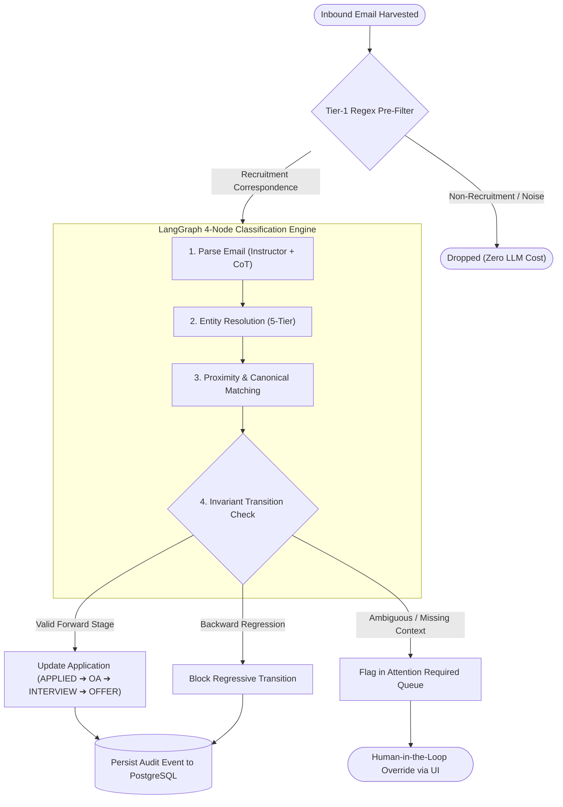
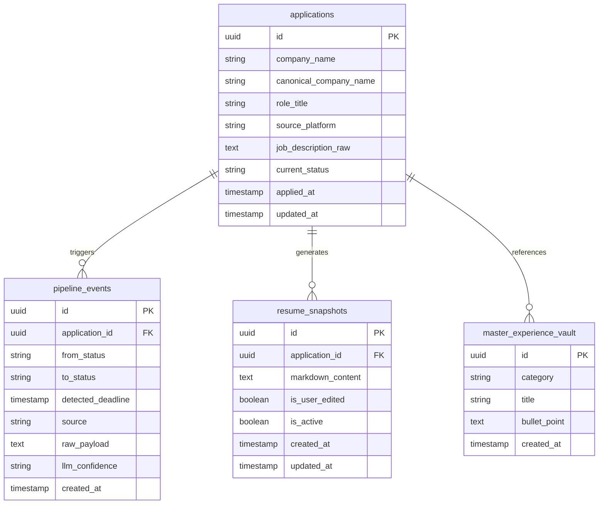

<p align="center">
  
  
  
  
  
  
</p>

# Applied — Autonomous Career Pipeline & Agentic Intelligence Engine

Applied is an event-driven, production-grade career pipeline system designed to eliminate manual bookkeeping for high-volume job seekers. Powered by an autonomous **Gmail ATS triage worker**, a deterministic **LangGraph state progression DAG**, and **grounded `pgvector` RAG resume tailoring**, Applied monitors inbound communications from enterprise ATS platforms (Workday, Greenhouse, Lever, Ashby), validates state changes against strict transition invariants, and snapshots tailored resumes with zero-shot anti-hallucination verification.

---

### Quick Links

| Resource | Link | Description |
| :--- | :--- | :--- |
| 🌐 **Live Web Application** | [applied-xi.vercel.app](https://applied-xi.vercel.app) | Production React 19 + TanStack Start UI hosted on Vercel |
| 📖 **Interactive API Docs** | [applied-api.onrender.com/docs](https://applied-api.onrender.com/docs) | OpenAPI 3.0 Swagger UI on Render |
| 🎨 **Frontend Monorepo** | [`frontend/`](./frontend/) | React 19, TanStack Start, Tailwind CSS, Kanban UI |
| ⚙️ **Backend Server** | [`web/`](./web/) | FastAPI, Instructor, LangGraph, pgvector RAG engine |
| 🤖 **Background Worker** | [`worker/`](./worker/) | Autonomous APScheduler + Gmail API + LangGraph triage |

---

## Why Applied?

Modern job searches suffer from compounding structural friction:
1. **Unstructured ATS Inbox Noise:** Emails from enterprise portals (Workday, Lever, Greenhouse, Taleo) arrive wrapped in automated disclaimers, multi-nested redirects, and confusing sender headers (e.g., `modmed@myworkday.com` representing *Modernizing Medicine*).
2. **Resume Version Drift:** When applicants tailor slightly different resume versions across dozens of companies, there is no reliable record of which specific claims and technical bullets were sent where—a major liability when interviewers reference specific points.
3. **Silent Portals & State Chaos:** Applications scatter across disconnected spreadsheets and inboxes. Many platforms never send confirmation receipts, leading to dropped follow-ups and missed assessment deadlines.

**Applied solves this by making the AI a functional state controller rather than a decorative chatbot.** Inbound communications trigger deterministic state progressions, verified resume snapshots are grounded in a semantic vector database, and human-in-the-loop controls allow immediate overrides for ambiguous edge cases.

---

## System Architecture

```mermaid
flowchart TD
    Client["Candidate Browser (React 19 + TanStack)"]
    Caddy["Caddy 2 Reverse Proxy (TLS / Ingress)"]
    FastAPI["FastAPI Backend Server (Render)"]
    Worker["Autonomous Triage Worker (APScheduler)"]
    Gmail["Google Gmail API (OAuth2)"]
    DB[("Supabase PostgreSQL 16 + pgvector")]
    OpenAI["OpenAI API (gpt-4o-mini + Embeddings)"]

    Client -->|HTTPS REST| Caddy
    Caddy -->|Proxy :8000| FastAPI
    
    Gmail -->|Periodic Polling (15m)| Worker
    Worker -->|1. Regex Pre-Filter| Worker
    Worker -->|2. LangGraph 4-Node DAG| OpenAI
    Worker -->|3. Persist State Changes| DB

    FastAPI -->|Extract JD & Match Bullets| OpenAI
    FastAPI -->|Cosine Semantic Search (1536-d)| DB
    FastAPI -->|Audit Events & Application CRUD| DB
    FastAPI -->|Realtime Updates| Client
```

---

## Key Architectural Features

### 1. Autonomous 2-Tier ATS Ingestion Pipeline
* **Tier-1 Heuristic Pre-Filter:** Drops spam, promotional newsletters, and non-application noise in under 5ms using targeted regex and blacklist heuristics, protecting downstream LLM quotas.
* **Tier-2 LangGraph Classification DAG:** Evaluates candidate emails through a 4-node state machine enforcing Chain-of-Thought (CoT) reasoning via `Instructor` and Pydantic schemas.
* **5-Tier Hierarchical Entity Resolution:** Automatically unwraps complex enterprise sender domains (Workday, Greenhouse, Taleo redirects), reconciles company names from email bodies, and matches them against existing applications.

### 2. Deterministic Application State Machine DAG
* Implements strict, non-reversible lifecycle progression:
  $$\text{APPLIED} \longrightarrow \text{OA\_PENDING} \longrightarrow \text{INTERVIEW\_ROUND} \longrightarrow \text{OFFER} \;\;/\;\; \text{REJECTED}$$
* Rejects backward transitions (e.g., an outdated confirmation email cannot revert an application already in the interview stage).
* Ambiguous matches or missing employer context automatically flag the application in the **Attention Required** UI queue for 1-click human reassignment.

### 3. Grounded RAG Resume Tailor & Anti-Hallucination Guard
* Indexes verified career achievements and technical claims in the `master_experience_vault` using **1536-dimensional OpenAI embeddings** (`text-embedding-3-small`) in PostgreSQL via `pgvector`.
* When a job description is pasted, the RAG engine performs cosine similarity retrieval to select the most relevant bullets.
* An automated **Anti-Hallucination Verification Guard** evaluates generated resumes against the source vault, rejecting ungrounded claims before persisting immutable resume snapshots.

### 4. Enterprise-Grade Kanban Control Surface
* Built on **React 19**, **TanStack Start**, and **Tailwind CSS**.
* Provides real-time pipeline visualization, drag-and-drop state updates, detailed application timeline drawers, and full CRUD management for the Master Experience Vault.

---

## 📊 Empirical Evaluation & Adversarial Hardening

To guarantee production reliability, the extraction and classification engine was evaluated against a rigorous **73-sample real-world dataset** (`tests/eval_data/`) annotated with ground-truth labels (`tests/ground_truth.json`). 

The benchmark incorporates authentic correspondence from Workday, Greenhouse, Lever, Ashby, HackerRank, and Codility, as well as **16 high-capacity adversarial traps** (polite rejections disguised as confirmations, promotional course offers, unsubmitted drafts, inbound vs. outbound referrals, and post-interview surveys).

### Production Benchmark Results

| Metric | Target | Baseline Pipeline | **Hardened Production Pipeline** | Status |
| :--- | :---: | :---: | :---: | :---: |
| **Stage Classification Accuracy** | $\ge 90.0\%$ | 81.48% | **`92.59%`** | **Exceeded (+11.11%)** |
| **Company Extraction Precision** | $\ge 93.0\%$ | 83.33% | **`100.00%`** | **Exceeded (+16.67%)** |
| **Relevance Gate Precision** | $\ge 95.0\%$ | 78.95% | **`98.15%`** | **Exceeded (+19.20%)** |
| **Relevance Gate Recall** | $\ge 95.0\%$ | 94.44% | **`98.15%`** (53/54) | **Exceeded (+3.71%)** |
| **Adversarial Trap Defense** | $\ge 85.0\%$ | 50.00% (8/16) | **`93.75%`** (15/16) | **Exceeded (+43.75%)** |
| **Repository Test Suite** | 100% Pass | 133 / 133 | **136 / 136 Passed** | **Zero Regressions** |

```bash
# Reproduce the complete evaluation benchmark runner
.venv/bin/pytest tests/test_extraction_pipeline.py -s -v
```

---

## 🖼️ Architectural Blueprints & Diagrams

### 1. LangGraph State Machine Flow



### 2. PostgreSQL Database Schema & Vector Indexes



---

## ⚙️ How It Works — End to End

```
[Drop Job Description] ──► [Cosine Retrieval (pgvector)] ──► [Hallucination Check] ──► [Snapshot Saved]
                                                                                               │
[Inbound Gmail Triage] ──► [Tier-1 Regex Pre-Filter]   ──► [LangGraph 4-Node DAG] ──► [State Advanced]
```

1. **New Job Drop:** The candidate pastes a raw Job Description (JD) into the UI (`/new-drop`). The backend extracts required competencies, queries the vector vault using cosine similarity, validates the selected bullets against the source experience, and records the initial `APPLIED` state.
2. **Headless Inbox Polling:** Every 15 minutes, the background worker queries the Gmail API for new recruitment-related threads using incremental history tokens.
3. **Multi-Stage Classification:** Inbound messages pass through Tier-1 regex filtering to eliminate newsletters and OTPs, before entering the LangGraph state machine where sender domains, subject lines, and body text are parsed with structured Pydantic schemas.
4. **State Progression & Audit Logging:** If an interview invitation or online assessment is detected, the application automatically transitions to `INTERVIEW_ROUND` or `OA_PENDING`, logging an immutable audit event in the database.
5. **Human-in-the-Loop Override:** If an email cannot be matched with high confidence, it is flagged in the **Attention Required** banner, allowing the candidate to manually reassign or resolve the event in one click.

---

## Tech Stack

| Category | Technologies | Description |
| :--- | :--- | :--- |
| **Backend API** | Python 3.11, FastAPI, Uvicorn, Pydantic v2 | High-concurrency async REST API with auto-generated OpenAPI docs |
| **AI & Agents** | LangGraph, LangChain, Instructor, OpenAI API | Deterministic state machine DAGs, structured outputs, CoT reasoning |
| **Database & Vector** | PostgreSQL 16, `pgvector`, SQLAlchemy, Alembic | Relational application tracking with 1536-dimensional cosine embeddings |
| **Frontend** | React 19, TanStack Start, TypeScript, Tailwind CSS | High-performance Kanban interface with dark/light mode and responsive drawers |
| **Worker & Automation** | APScheduler, Google Gmail API, OAuth2 | Asynchronous background polling and headless email thread harvesting |
| **DevOps & Ingress** | Docker, Docker Compose, Caddy 2, Render, Vercel | Multi-stage container builds, automatic TLS termination, CDN edge hosting |
| **Testing** | pytest, pytest-asyncio, HTTPX | 141 automated unit tests, integration suites, and adversarial benchmarks |

---

## API Overview

Interactive Swagger UI documentation is available live at **[applied-api.onrender.com/docs](https://applied-api.onrender.com/docs)**.

| Method | Endpoint | Description |
| :--- | :--- | :--- |
| `POST` | `/api/pipeline/single-drop` | End-to-end JD parsing, vector bullet matching, and application creation |
| `GET` | `/api/applications` | Retrieves all pipeline applications with current stages and timelines |
| `PATCH` | `/api/applications/{id}/status` | Direct manual status override (drag-and-drop Kanban updates) |
| `GET` | `/api/vault` | Fetches Master Experience Vault claims with category filtering |
| `POST` | `/api/vault` | Inserts new verified career bullet with automated 1536-d vector embedding |
| `DELETE` | `/api/vault/{id}` | Removes a bullet and cleans up corresponding vector embeddings |
| `GET` | `/health` | Kubernetes/Render container health-check endpoint |

---

## 📁 Repository Structure

```
├── frontend/                     # React 19 + TanStack Start frontend (Vercel)
│   ├── src/
│   │   ├── components/relay/     # Kanban board, AppCard, DetailDrawer, AttentionBanner
│   │   ├── routes/               # Pipeline (/), New Drop (/new-drop), Vault (/vault)
│   │   └── lib/api.ts            # Type-safe API client matching backend schemas
│   └── package.json
│
├── web/                          # FastAPI Backend Application
│   ├── main.py                   # REST endpoints, CORS policies, Vault CRUD, health checks
│   ├── services/
│   │   ├── pipeline.py           # Single-drop JD parser and orchestration
│   │   ├── rag_engine.py         # pgvector 1536-d semantic retrieval and OpenAI embeddings
│   │   ├── resume_generator.py   # Grounded resume tailoring with anti-hallucination checks
│   │   └── state_controller.py   # Deterministic status transitions and audit event logger
│   └── Dockerfile                # Production multi-stage Dockerfile
│
├── worker/                       # Autonomous Background Triage Worker
│   ├── main.py                   # APScheduler periodic worker loop
│   ├── gmail_client.py           # Headless Google OAuth2 client & thread harvester
│   ├── filter.py                 # Tier-1 regex heuristics filter
│   └── state_machine.py          # Tier-2 LangGraph 4-node classification DAG
│
├── db/                           # Database Layer
│   ├── models.py                 # SQLAlchemy ORM schemas (Applications, Vault, Events)
│   └── session.py                # PostgreSQL session factory with connection pooling
│
├── data/                         # Master experience vault seed records
│   ├── master_vault.json         # Curated career claims & technical bullets
│   └── master_vault.example.json # Public template
│
├── scripts/                      # Operational & Seed Scripts
│   ├── seed_vault.py             # Computes embeddings & seeds Supabase pgvector vault
│   ├── seed_demo_applications.py # Populates multi-stage Kanban applications
│   └── build_evaluation_dataset.py # Generates 73-sample evaluation benchmark
│
├── tests/                        # 141-Test Automated Test Suite
│   ├── test_extraction_pipeline.py # Production evaluation benchmark runner
│   ├── test_vault_endpoints.py   # Vault CRUD API integration tests
│   ├── test_state_machine.py     # State progression transition validation
│   └── test_resume_generator.py  # Anti-hallucination guard assertions
│
├── docs/                         # Engineering Documentation
│   ├── SYSTEM_DESIGN.md          # Comprehensive architecture specification & DDL
│   ├── EVALUATION_REPORT.md      # Production Model Evaluation & Adversarial Report
│   └── TESTING_STRATEGY.md       # Comprehensive testing matrix & coverage guide
│
├── docker-compose.yml            # Multi-service orchestration (Caddy + Web + Worker + DB)
└── Caddyfile                     # Reverse proxy with automatic Let's Encrypt TLS
```

---

## 🚀 Quickstart & Local Setup

### Prerequisites
* Python 3.11+
* Node.js 20+
* Docker & Docker Compose
* OpenAI API Key (`OPENAI_API_KEY`)

### Option A: One-Command Docker Compose
Launch the complete stack (FastAPI + Worker + PostgreSQL `pgvector` + Caddy reverse proxy):

```bash
# 1. Clone repository
git clone https://github.com/subham3604/applied.git
cd applied

# 2. Configure environment
cp .env.example .env
# Add OPENAI_API_KEY and Google OAuth credentials in .env

# 3. Launch stack
docker compose up -d --build
```
* **Frontend Web App:** `http://localhost`
* **API Documentation:** `http://localhost:8000/docs`
* **PostgreSQL pgvector:** `localhost:5433`

---

### Option B: Native Local Development

```bash
# 1. Setup Python Virtual Environment
python3 -m venv .venv
source .venv/bin/activate
pip install -r web/requirements.txt

# 2. Start PostgreSQL pgvector (via Docker)
docker run -d --name applied-db -p 5433:5432 \
  -e POSTGRES_USER=tracker_admin \
  -e POSTGRES_PASSWORD=tracker_secret_password \
  -e POSTGRES_DB=job_tracker \
  pgvector/pgvector:pg16

# 3. Run Migrations & Seed Vault
alembic upgrade head
python scripts/seed_vault.py --file data/master_vault.json

# 4. Start FastAPI Backend
uvicorn web.main:app --host 0.0.0.0 --port 8000 --reload

# 5. Start React Frontend (in a separate terminal)
cd frontend
npm install
npm run dev
```

Navigate to `http://localhost:5173` to open the local development dashboard.

---

## 🧪 Testing & Verification

The repository includes a comprehensive automated test suite of **141 tests** covering API contracts, RAG similarity retrieval, LangGraph DAG state transitions, manual overrides, and anti-hallucination verification:

```bash
# Run all unit and integration tests
.venv/bin/pytest tests/ -v

# Run the 73-sample evaluation benchmark with metrics summary
.venv/bin/pytest tests/test_extraction_pipeline.py -s -v
```

---

## 📄 License

Distributed under the MIT License. See `LICENSE` for more information.
