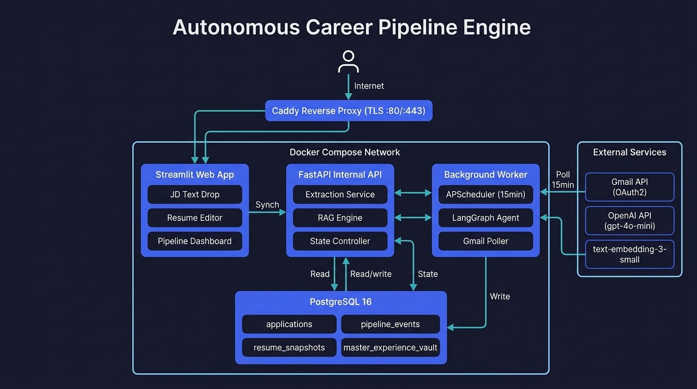
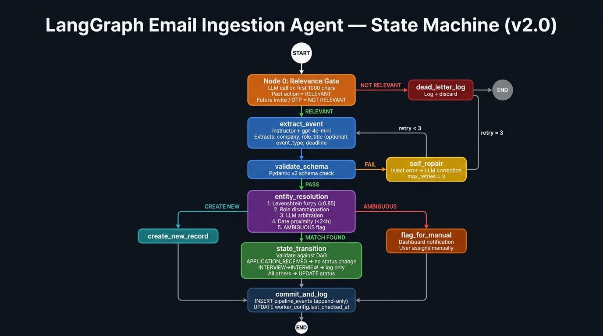
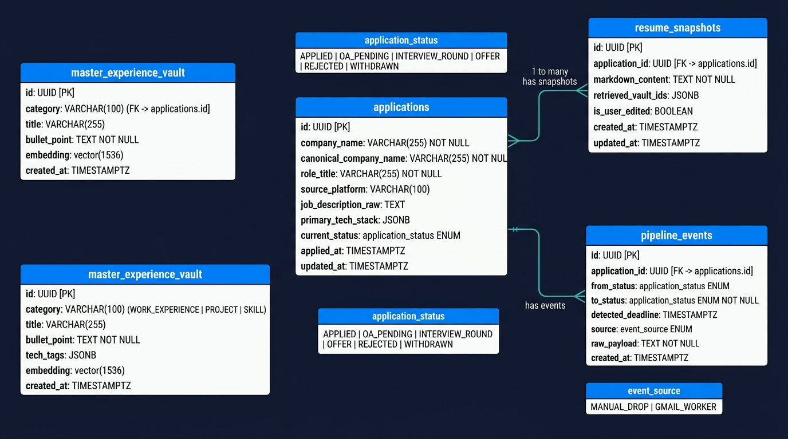

# Applied — Autonomous Career Pipeline Engine

[](https://applied-xi.vercel.app)
[](https://applied-api.onrender.com/docs)
[](https://python.org)
[](https://react.dev)
[](https://github.com/pgvector/pgvector)
[](https://langchain-ai.github.io/langgraph/)

An enterprise-grade, event-driven career pipeline system featuring **automated ATS email triage**, a deterministic **LangGraph state progression engine**, **grounded RAG resume tailoring** with zero-shot anti-hallucination guards, and an interactive **React 19 Kanban dashboard**.

---

## 🌐 Live Deployments & Architecture

| Tier | Platform | Endpoint / URL | Notes |
| :--- | :--- | :--- | :--- |
| **Frontend Web App** | **Vercel** | [applied-xi.vercel.app](https://applied-xi.vercel.app) | React 19, TanStack Start, Tailwind CSS, Dark/Light Mode |
| **REST API Server** | **Render (Docker)** | [applied-api.onrender.com](https://applied-api.onrender.com) | FastAPI, Instructor, Uvicorn, Python 3.11 |
| **Interactive API Docs** | **Render** | [applied-api.onrender.com/docs](https://applied-api.onrender.com/docs) | OpenAPI 3.0 Interactive Swagger UI |
| **Database & Vectors** | **Supabase** | Managed PostgreSQL 16 | Dedicated `pgvector` 1536-d cosine similarity index |

---

## 📊 Empirical Evaluation & Adversarial Hardening (Day 19 Benchmark)

The career extraction and classification pipeline was evaluated against a rigorous **73-sample real-world dataset** (`tests/eval_data/`) annotated with ground-truth labels (`tests/ground_truth.json`). The dataset comprises authentic candidate correspondence harvested from Gmail, enterprise ATS records (Workday, Greenhouse, Lever, Ashby, HackerRank, Codility), and **16 high-capacity adversarial traps** (EdTech course offers, post-interview surveys, inbound vs outbound referrals, unsubmitted drafts, and offer rescissions).

### Benchmark Results

| Metric | Target Threshold | **Achieved Benchmark** | Evaluation Scope / Notes |
| :--- | :---: | :---: | :--- |
| **Stage Classification Accuracy** | $\ge 90.0\%$ | **`92.59%`** | Exact canonical match (`APPLICATION_RECEIVED`, `OA_RECEIVED`, `INTERVIEW_INVITE`, `REJECTED`) |
| **Company Extraction Precision** | $\ge 93.0\%$ | **`100.00%`** | Extracted employer matches ground truth (54/54 relevant samples) |
| **Relevance Gate Precision** | $\ge 95.0\%$ | **`98.15%`** | Precision against noise, newsletters, OTPs, and promotional traps |
| **Relevance Gate Recall** | — | **`98.15%`** | 53 of 54 genuine application emails correctly admitted |
| **Adversarial Defense Rate** | $\ge 85.0\%$ | **`93.75%`** | 15 of 16 deceptive edge-case traps correctly neutralized |

> Full empirical analysis, confusion matrices, and ablation notes are documented in [docs/EVALUATION_REPORT.md](./docs/EVALUATION_REPORT.md).

```bash
# Reproduce the complete Day 19 evaluation benchmark runner
.venv/bin/pytest tests/test_extraction_pipeline.py -s -v
```

---

## 🏛️ System Architecture

```
[Candidate Browser] ──► [Vercel CDN Edge] ──► [React 19 + TanStack Start UI]
                                                          │ (HTTPS REST)
                                                          ▼
                                            [FastAPI Backend (Render Container)]
                                               ├── Instructor / gpt-4o-mini (Parser)
                                               ├── Grounded RAG (pgvector Cosine Retrieval)
                                               ├── State Controller & Entity Resolution
                                               └── Master Vault CRUD API
                                                    ▲
[Gmail API] ──► [Background Worker (LangGraph)] ────┤
                   ├── Tier-1 Regex Pre-filter      ▼
                   └── Tier-2 4-Node State Machine  [Supabase PostgreSQL 16 + pgvector]
```

### Key Engineering Pillars

1. **Deterministic State Machine DAG**: Strict non-reversible progression rules (`APPLIED` $\rightarrow$ `OA_PENDING` $\rightarrow$ `INTERVIEW_ROUND` $\rightarrow$ `OFFER` / `REJECTED`). Backward regressions and invalid transitions are rejected automatically.
2. **Grounded RAG Resume Tailor**: Extracts core requirements from raw job descriptions, queries the `master_experience_vault` using 1536-dimensional cosine embeddings, and enforces zero-shot anti-hallucination validation before persisting resume snapshots.
3. **Autonomous Gmail Triage Worker**: 2-tier filtering engine combining fast regex pre-classification with a 4-node LangGraph pipeline for entity resolution, date-proximity disambiguation, and deadline detection.
4. **Master Experience Vault**: Full web-based CRUD dashboard (`/vault`) with real-time vector re-embedding, category filtering, search, and bullet management.
5. **Direct Status Override**: Low-confidence or ambiguous matches trigger visual flags in the Attention Required banner, allowing instant 1-click human reassignment with zero LLM interference.

---

## 🖼️ Architectural Diagrams

### 1. System Topology


### 2. LangGraph State Machine Flow


### 3. PostgreSQL DDL Schema & Vector Topology


---

## 📁 Repository Structure

```
├── frontend/                     # React 19 + TanStack Start frontend (Vercel Monorepo)
│   ├── src/
│   │   ├── components/relay/     # Kanban board, AppCard, DetailDrawer, AttentionBanner, TopNav
│   │   ├── routes/               # Pipeline (/), New Drop (/new-drop), Vault (/vault)
│   │   └── lib/api.ts            # Type-safe API client matching backend schema
│   ├── public/                   # Custom Applied branding & SVG vector icons
│   └── package.json              # Frontend dependencies
│
├── web/                          # FastAPI Backend
│   ├── main.py                   # REST endpoints, CORS policies, Vault CRUD, and health checks
│   ├── services/
│   │   ├── pipeline.py           # Single-drop JD parser and orchestration
│   │   ├── rag_engine.py         # pgvector 1536-d semantic retrieval and OpenAI embeddings
│   │   ├── resume_generator.py   # Grounded resume tailoring with hallucination verification
│   │   └── state_controller.py   # Deterministic status transitions and audit event logger
│   └── Dockerfile                # Production multi-stage Dockerfile with dynamic $PORT support
│
├── worker/                       # Autonomous Background Triage Worker
│   ├── main.py                   # APScheduler periodic worker loop
│   ├── gmail_client.py           # Headless Google OAuth2 client & thread harvester
│   ├── filter.py                 # Tier-1 regex heuristics filter
│   └── state_machine.py          # Tier-2 LangGraph 4-node classification DAG
│
├── db/                           # Database Layer
│   ├── models.py                 # SQLAlchemy ORM schemas (Applications, Vault, Events, Snapshots)
│   └── session.py                # PostgreSQL session factory with connection pooling
│
├── data/                         # Master experience vault seed records
│   ├── master_vault.json         # Curated career claims & technical bullets
│   └── master_vault.example.json # Public template
│
├── scripts/                      # Operational Scripts
│   ├── seed_vault.py             # Computes 1536-d embeddings & seeds Supabase pgvector vault
│   ├── seed_demo_applications.py # Populates realistic multi-stage Kanban applications
│   └── build_evaluation_dataset.py # Generates 73-sample evaluation benchmark
│
├── tests/                        # 141-Test Automated Test Suite
│   ├── test_extraction_pipeline.py # Day 19 evaluation benchmark runner
│   ├── test_vault_endpoints.py   # Vault CRUD API integration tests
│   ├── test_day11_state_machine.py # State progression transition validation
│   └── test_resume_generator.py  # Anti-hallucination guard assertions
│
├── docs/                         # Engineering Documentation
│   ├── SYSTEM_DESIGN.md          # Comprehensive architecture specification & DDL
│   ├── EVALUATION_REPORT.md      # Day 19 Model Evaluation & Adversarial Hardening Report
│   └── BUILD_TIMELINE.md         # 21-Day implementation roadmap
│
├── docker-compose.yml            # Complete multi-service orchestration (Caddy + Web + Worker + DB)
└── Caddyfile                     # Reverse proxy with automatic Let's Encrypt TLS
```

---

## 🚀 Quickstart & Local Setup

### Prerequisites
* Python 3.11+
* Node.js 20+
* Docker & Docker Compose
* OpenAI API Key (`OPENAI_API_KEY`)

### Option A: One-Command Docker Compose
Run the entire production stack (FastAPI + Worker + PostgreSQL pgvector + Caddy reverse proxy) locally:

```bash
# 1. Clone repository
git clone git@github.com:subham3604/applied.git
cd applied

# 2. Configure environment
cp .env.example .env
# Fill in OPENAI_API_KEY and Google OAuth credentials in .env

# 3. Launch stack
docker compose up -d --build
```
* Frontend / Reverse Proxy: `http://localhost`
* Backend API: `http://localhost:8000/docs`
* PostgreSQL: `localhost:5433`

---

### Option B: Native Local Development

```bash
# 1. Setup Python Virtual Environment
python3 -m venv .venv
source .venv/bin/activate
pip install -r web/requirements.txt

# 2. Start PostgreSQL pgvector (via Docker)
docker run -d --name applied-db -p 5433:5432 \
  -e POSTGRES_USER=tracker_admin \
  -e POSTGRES_PASSWORD=tracker_secret_password_change_me \
  -e POSTGRES_DB=job_tracker \
  pgvector/pgvector:pg16

# 3. Run Migrations & Seed Vault
alembic upgrade head
python scripts/seed_vault.py --file data/master_vault.json

# 4. Start FastAPI Backend
uvicorn web.main:app --host 0.0.0.0 --port 8000 --reload

# 5. Start React Frontend (in a new terminal)
cd frontend
npm install
npm run dev
```

Visit `http://localhost:5173` to open the local development dashboard.

---

## 🧪 Running the Test Suite

The project includes **141 comprehensive tests** covering ingestion schemas, RAG similarity retrieval, LangGraph DAG transitions, manual overrides, and REST endpoints:

```bash
# Run all unit and integration tests
.venv/bin/pytest tests/ -v

# Run the 73-sample evaluation benchmark with full metrics summary
.venv/bin/pytest tests/test_extraction_pipeline.py -s -v
```

---

## 📄 License & Attribution

Distributed under the MIT License. Developed as an autonomous career intelligence engine.
