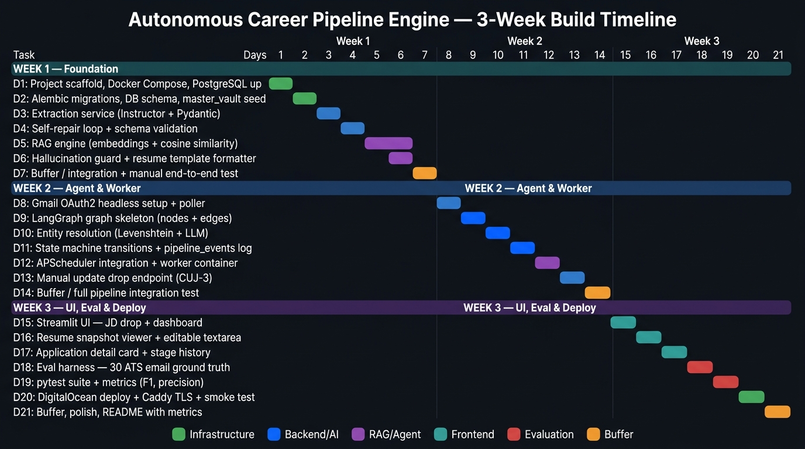

# Autonomous Career Pipeline Engine — Build Timeline & Task Flow

> **Constraint:** 3 weeks (21 calendar days), solo developer
> **Philosophy:** Backend-first, UI-last. If any week slips, the UI gets cut — not the AI engine.

---

## Gantt Chart Overview


*3-week build plan — 21 days, each day's output is immediately testable before the next begins*

---

## Phase Summary

| Phase | Days | Focus | End State |
|---|---|---|---|
| **Phase 1: Foundation** | Days 1–7 | Infrastructure + Extraction + RAG | Paste a JD → get a grounded Markdown resume saved to DB via terminal |
| **Phase 2: Agent & Worker** | Days 8–14 | Gmail filter + LangGraph + Entity Resolution + State Machine | Emails auto-process the DB with zero user action |
| **Phase 3: UI, Eval & Deploy** | Days 15–21 | React UI (Vercel) + FastAPI + Eval Harness + Split Deploy | Live Vercel SPA + DigitalOcean API with portfolio metrics |

---

## Phase 1: Foundation (Days 1–7)

> **Goal by Day 7:** Core AI logic working locally. No UI, no worker.

---

### Day 1 — Project Scaffold & Docker Infrastructure

**Time estimate:** 3–4 hours

**Tasks:**
- [ ] Create GitHub repo with directory structure: `web/`, `worker/`, `tests/`, `docs/`
- [ ] Write `docker-compose.yml` with all 4 services: `caddy`, `db`, `web`, `worker`
- [ ] Write `Dockerfile` for `web` and `worker` (Python 3.11-slim base)
- [ ] Spin up PostgreSQL: `docker compose up db` — verify `psql` connection
- [ ] Create `.env` with placeholder values; add to `.gitignore`
- [ ] Write `requirements.txt` for both `web/` and `worker/`

**Deliverable check:** `docker compose up db` runs. `psql` connects. PostgreSQL is alive.

**Risk flag 🔴:** Use `docker compose` (v2) not `docker-compose` (v1). Check with `docker compose version`.

---

### Day 2 — Database Schema & Master Vault

**Time estimate:** 4–5 hours

**Tasks:**
- [ ] Install and init Alembic: `alembic init migrations`
- [ ] Write migration for all 5 tables:
  - `applications`, `resume_snapshots`, `pipeline_events`, `master_experience_vault`, `worker_config`
- [ ] `event_source` enum must include all three values: `MANUAL_DROP`, `GMAIL_WORKER`, `MANUAL_OVERRIDE`
- [ ] Enable `pgvector`: `CREATE EXTENSION IF NOT EXISTS vector` in migration
- [ ] Run `alembic upgrade head` — verify all tables created
- [ ] Write `master_vault.json` seed file with your actual projects, bullets, and tech tags
- [ ] Write `seed_vault.py`: reads vault JSON → calls `text-embedding-3-small` per bullet → inserts with embeddings

**Deliverable check:** `python seed_vault.py` runs. `SELECT COUNT(*) FROM master_experience_vault` returns your bullet count. Embeddings stored.

**Time sink warning ⚠️:** Writing the master vault content takes 1–1.5 hours. Every bullet must be real, specific, and metric-rich. This is the foundation of the RAG pipeline. Don't rush it.

---

### Day 3 — Extraction Service (Instructor + Pydantic)

**Time estimate:** 4–5 hours

**Tasks:**
- [ ] Install: `instructor`, `openai`, `pydantic` v2
- [ ] Define `JobApplication` Pydantic schema: company, role, tech_stack, experience, location, platform
- [ ] Define `ApplicationStatus` and `EventSource` enums matching DB types
- [ ] Write `extraction.py` — `parse_job_description(raw_text: str) -> JobApplication`
- [ ] Test with 3 real Naukri JD text dumps — verify company, role, stack extracted correctly

**Deliverable check:** `python -c "from services.extraction import parse_job_description; print(parse_job_description(open('test_jd.txt').read()))"` returns a clean Pydantic object.

---

### Day 4 — Self-Repair Loop & DB Write

**Time estimate:** 3 hours

**Tasks:**
- [ ] Add `max_retries=3` to Instructor call
- [ ] Write circuit breaker wrapper: 3 failures → structured failure response, no crash
- [ ] Test with intentionally sparse JD text — verify retry fires then fails gracefully
- [ ] Write `db_writer.py`: `insert_application(job: JobApplication) -> UUID` via SQLAlchemy 2.0
- [ ] Test full insert: parse JD → insert → `SELECT * FROM applications` confirms row

**Deliverable check:** Deliberately bad JD (2 sentences, no company) → system retries → fails gracefully without unhandled exception.

---

### Day 5 — RAG Engine: Embeddings & Cosine Similarity

**Time estimate:** 4–5 hours

**Tasks:**
- [ ] Write `rag_engine.py`
- [ ] `embed_text(text: str) -> list[float]` — calls `text-embedding-3-small`
- [ ] `get_relevant_bullets(jd_requirements: str, top_k: int = 5) -> list[VaultBullet]`
  - Embeds JD requirements section
  - pgvector cosine similarity query (SQL) or numpy fallback if vault < 100 entries
  - Returns top-k ranked bullets with similarity scores
- [ ] Test: backend-focused JD → top-5 bullets should all be backend-related

**Deliverable check:** `get_relevant_bullets("Python, PostgreSQL, Redis, 2 years")` returns relevant backend bullets ranked correctly, not frontend ones.

---

### Day 6 — Hallucination Guard & Resume Template

**Time estimate:** 4–5 hours

**Tasks:**
- [ ] Write the fixed Markdown template system prompt (Name, Contact, Education, Skills, Work Experience, Projects)
- [ ] Write `generate_resume_snapshot(jd_text, vault_bullets) -> str`
  - Inject retrieved bullets + template into `gpt-4o-mini`
  - Instruction: "Format ONLY using the provided bullets. Do not invent any technology, metric, or tool."
- [ ] Write `hallucination_guard(generated_md, source_bullets) -> GuardResult`
  - Extract technical terms from generated Markdown (regex: capitalised tools, version numbers, percentages)
  - Cross-check each term against source bullets text
  - Return PASS or FAIL with flagged terms
- [ ] Wire: FAIL → correction prompt to LLM → regenerate (max 2 attempts)

**Deliverable check:** JD mentions Kafka. Vault has no Kafka bullet. Guard rejects the hallucination and forces removal.

---

### Day 7 — Phase 1 Buffer & Integration Test

**Time estimate:** 3–4 hours

**Tasks:**
- [ ] Write `test_phase1.py`: JD text in → extract → validate → insert to DB → retrieve bullets → generate resume → guard → save snapshot
- [ ] Fix any integration bugs
- [ ] Check OpenAI dashboard: API cost should be well under \$1 for all Day 1–6 testing
- [ ] Catch up on any slipped tasks from Days 1–6

**Deliverable check:** `python test_phase1.py` with real Naukri JD produces a valid Markdown resume in the DB without uncaught exceptions.

---

## Phase 2: Agent & Worker (Days 8–14)

> **Goal by Day 14:** Emails are processed automatically. No user action required.

---

### Day 8 — Gmail OAuth + Two-Layer Filter Construction

**Time estimate:** 4–5 hours

**Tasks:**
- [ ] Create Google Cloud Project → enable Gmail API → create OAuth2 Desktop credentials
- [ ] Run `local_auth.py` locally (one-time) → copy `CLIENT_ID`, `CLIENT_SECRET`, `REFRESH_TOKEN` to `.env`

  > **Google OAuth trap 🔴:** In Google Cloud Console → OAuth consent screen → add your email as a test user. Without this, the API rejects calls silently even with valid credentials.

- [ ] Write `gmail_poller.py`:
  - `build_credentials_from_env() -> Credentials` — builds OAuth from env vars, no browser needed
  - `fetch_new_emails(last_checked_at: datetime) -> list[EmailMessage]` — executes two-layer filtered query
- [ ] Implement `build_gmail_query()` with positive and negative subject terms:
  ```
  Positive: "application received", "your application", interview, assessment,
            "you applied for 1 job", "offer letter", "next steps", etc.
  Negative: "apply now", "is a match", "security code", "verify your identity",
            "one-time passcode", "see what employees have to say", etc.
  Blocked senders: -from:ambitionbox.com
  ```
- [ ] Test: `python gmail_poller.py` — should return real application emails, NOT promotionals, NOT OTP emails

**Deliverable check:** Greenhouse "Security code" email is excluded. Zyntrix "Application Received" email is included. LinkedIn "apply now" is excluded.

---

### Day 9 — LangGraph Graph Skeleton + Relevance Gate (Node 0)

**Time estimate:** 5 hours

**Tasks:**
- [ ] Install `langgraph`
- [ ] Define `AgentState` with all fields: `raw_email_text`, `email_received_at`, `is_relevant`, `parsed_event`, `retry_count`, `matched_application_id`, `resolution_confidence`, `resolution_note`, `is_new_application`, `status_changed`, `committed`
- [ ] **Implement Node 0: `relevance_gate`** — the new first node
  - Cheap LLM call on first 1000 chars of email
  - Classifies: confirms something already done (RELEVANT) vs. invites future action or is mid-submission OTP (NOT RELEVANT)
  - Explicit handling: Naukri "N jobs" summary → NOT RELEVANT; Naukri "1 job" with body content → RELEVANT; OTP/security code emails → NOT RELEVANT
  - Routes NOT RELEVANT to `dead_letter_log`
- [ ] Implement stub nodes for all others: `extract_event`, `validate_schema`, `self_repair`, `entity_resolution`, `state_transition`, `create_new_record`, `flag_for_manual`, `commit_and_log`, `dead_letter_log`
- [ ] Wire complete graph with all conditional edges
- [ ] Test graph traversal with a dummy email

**Deliverable check:** `graph.invoke({"raw_email_text": "dummy", "email_received_at": datetime.now()})` traverses expected path. AmbitionBox email routes to dead_letter_log at Node 0.

---

### Day 10 — Entity Resolution: Full Fallback Chain

**Time estimate:** 5–6 hours ← **hardest single day of the project**

**Tasks:**
- [ ] Install `python-Levenshtein`
- [ ] Write `entity_resolution.py`:
  - `normalize_company_name(name)` — strip "pvt ltd", "private limited", "ltd", "inc", "corp", "technologies", "solutions" etc.
  - `fuzzy_match(query, candidates) -> (best_match, score)` — normalized Levenshtein
  - `role_disambiguate(role_raw, candidates)` — fuzzy match on role_title
  - `llm_arbitrate(company_raw, role_raw, candidates)` — LLM disambiguation prompt; must return application_id, "NEW", or "AMBIGUOUS"
  - `date_proximity_match(email_received_at, candidates, threshold_hours=24)` — returns closest match or AMBIGUOUS
- [ ] Implement the full fallback chain:
  ```
  0 matches → CREATE_NEW
  1 match → UPDATE (HIGH)
  N matches + role known → role fuzzy → LLM arbitrate → AMBIGUOUS
  N matches + role None → date proximity → AMBIGUOUS
  ```
- [ ] Plug into `node_entity_resolution` in LangGraph
- [ ] Test all cases:
  - "Bundl Technologies Pvt Ltd" → resolves to "Swiggy" (LLM arbitration)
  - "Zomato Media Private Limited" → resolves to "Zomato" (fuzzy + normalization)
  - Two roles at same company, role absent, email same day → LOW confidence date match
  - Two roles at same company, role absent, email 3 days later → AMBIGUOUS
  - Unknown company → CREATE_NEW

**Deliverable check:** All 5 test cases resolve correctly. LLM arbitration prompt returns "AMBIGUOUS" — not a hallucinated ID — when confident resolution is impossible.

---

### Day 11 — Non-linear State Machine + APPLICATION_RECEIVED Handling

**Time estimate:** 3–4 hours

**Tasks:**
- [ ] Implement `ApplicationEventType` enum: `APPLICATION_RECEIVED`, `OA_RECEIVED`, `INTERVIEW_INVITE`, `OFFER`, `REJECTED`
- [ ] Implement non-linear `VALID_TRANSITIONS` DAG:
  ```python
  APPLIED: [OA_PENDING, INTERVIEW_ROUND, OFFER, REJECTED, WITHDRAWN]
  OA_PENDING: [INTERVIEW_ROUND, OFFER, REJECTED, WITHDRAWN]
  INTERVIEW_ROUND: [INTERVIEW_ROUND, OFFER, REJECTED, WITHDRAWN]
  OFFER: [REJECTED, WITHDRAWN]
  REJECTED: []
  WITHDRAWN: []
  ```
- [ ] Implement `node_state_transition`:
  - `APPLICATION_RECEIVED` → no `current_status` change, set `status_changed = False`
  - `INTERVIEW_ROUND → INTERVIEW_ROUND` → no status change, log new event
  - All other valid transitions → UPDATE + log
  - Invalid transition (backward) → log warning, do not update
- [ ] Implement `node_create_new_record`: INSERT new application row when entity resolution returns CREATE_NEW
- [ ] Implement `node_commit_and_log`: INSERT `pipeline_events` row in all cases
- [ ] Test: rejection email → `REJECTED`; OA after manual Naukri drop → `APPLICATION_RECEIVED` logs but status stays `APPLIED`; Round 2 invite → `INTERVIEW_ROUND → INTERVIEW_ROUND` logs new event

**Deliverable check:** Naukri "You applied for 1 job" email on same-day manually-logged application → status stays `APPLIED`, audit row logged with note "Application receipt confirmed by Naukri".

---

### Day 12 — APScheduler + Worker Container

**Time estimate:** 3 hours

**Tasks:**
- [ ] Write `worker.py`:
  - Initialize APScheduler with `CronTrigger(hour=8, minute=0)`
  - On each trigger: read `last_checked_at` from `worker_config`, fetch emails, run LangGraph per email, update `last_checked_at` only on successful commit
- [ ] Run locally: `python worker.py` — verify cron fires and logs activity
- [ ] Build worker Docker container: `docker compose build worker`
- [ ] `docker compose up worker db` — watch logs 30+ minutes for stability

**Deliverable check:** `docker compose logs -f worker` shows cron firing and processing without crash loops.

---

### Day 13 — Manual Update Drop + Direct Status Override

**Time estimate:** 3–4 hours

**Tasks:**
- [ ] Write `parse_status_update(raw_text, current_status) -> JobEvent`:
  - Instructor extraction of `event_type` and `detected_deadline` from pasted portal text
  - Validates extracted event maps to a valid transition from `current_status`
- [ ] Wire into `state_controller.py` with `source = MANUAL_DROP`
- [ ] Write `apply_manual_override(application_id, new_status, note) -> None`:
  - Direct DB update bypassing transition validation
  - `source = MANUAL_OVERRIDE`
  - Accepts any `new_status` (force correction path)
- [ ] Test: paste "Interview on Sep 22 at 2PM" → detects INTERVIEW_ROUND, updates DB
- [ ] Test override: force `OA_PENDING → APPLIED` (backward correction) → succeeds with MANUAL_OVERRIDE source

**Deliverable check:** Manual text drop and direct override both write correct `pipeline_events` rows with distinct `event_source` values.

---

### Day 14 — Phase 2 Buffer & Full Pipeline Integration Test

**Time estimate:** 4 hours

**Tasks:**
- [ ] Write `test_phase2.py`:
  1. Insert test application: {company: "Swiggy", role: "SDE-1", status: APPLIED}
  2. Feed "Bundl Technologies — OA invitation" email directly to LangGraph agent
  3. Assert: entity resolved to Swiggy, status → OA_PENDING, pipeline_events row created
  4. Feed another email with no role, same-day timestamp → LOW confidence date match
  5. Feed email with 5-day gap, same company, two applications → AMBIGUOUS flag
- [ ] Fix LangGraph edge routing bugs found during test
- [ ] Run `docker compose up db worker` for 30+ minutes — verify memory stability

**Deliverable check:** All 5 integration test cases pass. Worker runs stable.

---

## Phase 3: UI, Eval & Deploy (Days 15–21)

> **Goal by Day 21:** Live HTTPS URL, portfolio metrics in README, demo GIF recorded.

---

### Day 15 — FastAPI HTTP Layer & API Contract Alignment

**Time estimate:** 4–5 hours

**Tasks:**
- [x] Write `web/main.py` exposing all 7 REST endpoints matching frontend requirements:
  - `GET /api/metrics`, `GET /api/applications`, `GET /api/applications/{id}`
  - `POST /api/applications/parse`, `PATCH /api/applications/{id}/resume`
  - `PATCH /api/applications/{id}/status`, `POST /api/applications/{id}/text-update`
- [x] Implement serializers matching frontend `relay-data.ts` TypeScript types (field names, enum mapping, deadline tone, computed priority)
- [x] Configure CORS middleware for `http://localhost:5173`, `http://localhost:3000`, and Vercel preview domains
- [x] Update `PipelineResult` in `pipeline.py` to return `location` and `source_platform`
- [ ] Create `src/lib/api.ts` in frontend repo (`pixel-perfect-render-1659`) with typed fetch helpers

**Deliverable check:** `curl http://localhost:8000/api/applications` and `curl http://localhost:8000/api/metrics` return clean JSON matching frontend TypeScript interfaces.

---

### Day 16 — React UI: Wire Kanban Dashboard & New Drop Route

**Time estimate:** 4 hours

**Tasks:**
- [ ] Wire `src/routes/index.tsx` with dynamic state from `fetchApplications()` and `fetchMetrics()`
- [ ] Connect search query input and stage filters ("All", "High Priority", "Active", "Archived") to live application state
- [ ] Wire `src/routes/new-drop.tsx`:
  - On "🚀 Parse & Tailor Resume" click: call `POST /api/applications/parse` with `{ jd_text, source_platform }`
  - Populate extracted metadata card (company, role, stack, location) and pre-fill Markdown resume editor
  - Show loading state and error toasts via `sonner`
  - Wire "Confirm & Save to Pipeline" button: call `PATCH /api/applications/{id}/resume` if user made edits, then redirect to `/`

**Deliverable check:** Paste a real JD in React UI → metadata card and tailored Markdown resume appear on screen within 3s → confirm and card appears in "Applied" column.

---

### Day 17 — Detail Drawer Controls, Overrides & Verification

**Time estimate:** 4 hours

**Tasks:**
- [ ] Wire card click on Kanban board to open `DetailDrawer.tsx` with full audit timeline from `pipeline_events`
- [ ] Wire "Direct Status Override" dropdown + note input to `PATCH /api/applications/{id}/status` (`MANUAL_OVERRIDE`)
- [ ] Wire "Paste Portal Snippet" textarea to `POST /api/applications/{id}/text-update` (`MANUAL_DROP`)
- [ ] Wire "Copy Resume" button to clipboard via `navigator.clipboard.writeText`
- [ ] Wire `AttentionBanner.tsx` for Ambiguous Email resolution
- [ ] Run end-to-end local smoke tests for CUJ-1 (JD Drop), CUJ-3 (Portal Snippet), and CUJ-4 (Direct Override)

**Deliverable check:** Status override updates stage instantly without page refresh. Timeline displays correct `🤖 Worker`, `👤 Manual`, and `⚡ Override` badges. Full end-to-end flow verified locally.

---

### Day 18 — Eval Harness: Ground Truth Dataset

**Time estimate:** 4–5 hours

**Tasks:**
- [ ] Create `tests/eval_data/` directory
- [ ] Collect 30+ real email texts, saved as `.txt` files:
  - 10 rejection emails (Greenhouse, Lever, Workday, generic company HR, Indian ATS)
  - 8 OA invitations (HackerRank, HackerEarth, Mercer Mettl, Codility)
  - 7 interview invite emails (Zoom, Google Meet, in-person)
  - 5 non-status confirmations ("application received", "we'll review soon")
  - 5 irrelevant emails that should be filtered: LinkedIn promotional, Naukri job alert, AmbitionBox review nudge, OTP email, "N jobs" Naukri summary
- [ ] Write `tests/ground_truth.json` — each filename mapped to expected event_type (or "IRRELEVANT")

**Deliverable check:** `tests/eval_data/` has 35+ `.txt` files. `ground_truth.json` has matching labels for all.

---

### Day 19 — pytest Suite & Portfolio Metrics

**Time estimate:** 4 hours

**Tasks:**
- [ ] Write `tests/test_extraction_pipeline.py`:
  - Loop over all eval_data files
  - Run each through relevance gate first (irrelevant files should be filtered here)
  - Run relevant files through full extraction pipeline
  - Compare extracted `event_type` against `ground_truth.json`
  - Compute:
    - **Stage Classification Accuracy:** % correct event_type on relevant emails
    - **Relevance Gate Precision:** % of irrelevant emails correctly rejected
    - **Entity Extraction Precision:** % of correctly extracted company names
    - **Schema Repair Recovery Rate:** % of schema failures recovered via self-repair
- [ ] Run `pytest tests/ -v` — record actual numbers
- [ ] Write numbers into `README.md`

**Target metrics:**
- Stage Classification Accuracy: ≥ 90%
- Relevance Gate Precision: ≥ 95% (OTP + promotional must be rejected)
- Entity Extraction Precision: ≥ 93%
- Schema Repair Recovery Rate: ≥ 85%

**Deliverable check:** `pytest` runs and prints a metrics summary. Hard numbers ready for resume.

---

### Day 20 — Split Deployment: Vercel (Frontend) + DigitalOcean (Backend & Worker)

**Time estimate:** 4–5 hours

**Tasks:**
- [ ] Deploy React frontend (`pixel-perfect-render-1659`) to Vercel:
  - Connect GitHub repo
  - Set project environment variable: `VITE_API_URL=https://api.yourdomain.com`
- [ ] Create DigitalOcean Droplet: Ubuntu 24.04, 2GB RAM, BLR1
- [ ] Point DNS records:
  - `relay.yourdomain.com` → Vercel CNAME
  - `api.yourdomain.com` → Droplet IP (A record)
- [ ] SSH into Droplet → install Docker → configure UFW (22, 80, 443)
- [ ] `git clone` backend repo to `/opt/ai-job-tracker`
- [ ] Create `.env` on server with production backend secrets (`POSTGRES_PASSWORD`, `DATABASE_URL`, `OPENAI_API_KEY`, `GMAIL_*`)
- [ ] Write `Caddyfile`:
  ```caddyfile
  api.yourdomain.com {
      reverse_proxy web:8000
  }
  ```
- [ ] `docker compose up -d --build` (runs Caddy, FastAPI `web:8000`, PostgreSQL `pgvector`, and `worker`)
- [ ] Smoke test on mobile:
  - Open `https://relay.yourdomain.com`
  - Paste real JD → verify extraction and tailoring work against live backend over HTTPS
  - Test Direct Status Override on a card
- [ ] Inspect logs: `docker compose logs -f web worker` — verify zero unhandled exceptions

**Deliverable check:** React SPA live on Vercel; FastAPI API and LangGraph worker live on DigitalOcean with automatic Let's Encrypt TLS. End-to-end user journeys pass in production.

**Risk flag 🔴:** DNS propagation takes 5–30 minutes. Verify DNS resolution with `dig +short api.yourdomain.com` before debugging Caddy certificate issuance.

---

### Day 21 — Buffer, Polish & README

**Time estimate:** 3–4 hours

**Tasks:**
- [ ] Fix any production bugs from Day 20
- [ ] Write `README.md`:
  - One-paragraph project description
  - Architecture diagram (embed image)
  - Tech stack table
  - Hard metrics from Day 19 (copy verbatim)
  - Setup: `docker compose up`
  - Demo GIF: record 15s QuickTime → convert to GIF via `ffmpeg`
    - Show: paste JD → resume generated → Gmail email auto-updates status
- [ ] Verify `.env` is NOT in GitHub (`git status` should not show it)
- [ ] Push final code

**Deliverable check:** GitHub README has hard numbers, architecture diagram, and demo GIF. Anyone can clone and run with `docker compose up`.

---

## Risk Register

| Risk | Probability | Impact | Mitigation |
|---|---|---|---|
| Gmail OAuth setup delays | Medium | Day 8 slips | Use Desktop app flow, NOT Web app. Add test user in consent screen immediately. |
| Entity resolution accuracy low on Indian platforms | Medium | Core feature degrades | Start with 0.75 fuzzy threshold, tune up. LLM arbitration is the safety net. |
| Naukri "N jobs" email body format changes | Low | False positive slips through | Relevance gate catches it — body will have no job title, gate rejects it |
| OTP email subject format changes | Low | OTP slips into pipeline | Relevance gate's "code + expires in 10 minutes" signal catches even novel OTP formats |
| OpenAI API costs spike during testing | Low | Financial | Use `gpt-4o-mini`. Set hard \$5 alert in OpenAI dashboard. Daily polling reduces cost by 96% vs 15-minute schedule. |
| DigitalOcean Droplet memory pressure during build | Low | Day 20 slips | `docker compose build` on 1GB RAM can OOM. If it fails, temporarily upgrade to 2GB for the build, downgrade after. |
| LangGraph API breaking changes | Low | Days 9–14 affected | Pin version in `requirements.txt`. Read 0.2.x docs specifically. |

---

## Scope Protection Rules

Cut in this exact order — never cut the AI core:

| Priority | Keep / Cut |
|---|---|
| ✅ Always keep | Extraction service, self-repair loop, RAG engine, hallucination guard |
| ✅ Always keep | LangGraph agent + full entity resolution chain + non-linear state DAG |
| ✅ Always keep | Eval harness + metrics (Day 18–19) — these are the portfolio proof |
| ⚠️ Cut if 2 days behind | Force Override UI — basic Direct Override is enough |
| ⚠️ Cut if 2 days behind | Low-confidence ⚠️ badge — just let AMBIGUOUS flag surface |
| ⚠️ Cut if 3 days behind | Stage Update Drop text paste (CUJ-3) — Direct Override covers most cases |
| ❌ Last resort | Streamlit → replace with terminal demo script for portfolio recording |

---

## Daily Time Budget

| Day | Estimate | Category |
|---|---|---|
| D1 | 3–4h | Infrastructure |
| D2 | 4–5h | Infrastructure + Vault content |
| D3 | 4–5h | AI Engineering |
| D4 | 3h | AI Engineering |
| D5 | 4–5h | AI Engineering |
| D6 | 4–5h | AI Engineering |
| D7 | 3–4h | Buffer |
| D8 | 4–5h | Integration (Gmail filter is now more complex) |
| D9 | 5h | Agent Engineering (Node 0 is new) |
| D10 | 5–6h | Agent Engineering (hardest day) |
| D11 | 3–4h | Agent Engineering |
| D12 | 3h | DevOps |
| D13 | 3–4h | Feature |
| D14 | 4h | Buffer |
| D15 | 4–5h | Frontend |
| D16 | 3–4h | Frontend |
| D17 | 4h | Frontend (more controls than original estimate) |
| D18 | 4–5h | Eval (content-heavy) |
| D19 | 4h | Eval |
| D20 | 4–5h | DevOps |
| D21 | 3–4h | Polish |
| **Total** | **~82–96 hours** | |

> ~82–96 hours over 21 days = **~4–4.5 hours/day**. Tight but achievable.

---

*Timeline v2.0 — updated to reflect: daily cron schedule, two-layer Gmail filter build on Day 8, Relevance Gate (Node 0) on Day 9, full four-level entity resolution chain on Day 10, non-linear state DAG on Day 11, three-control update UI on Day 17, and expanded eval harness covering relevance gate precision on Days 18–19.*
