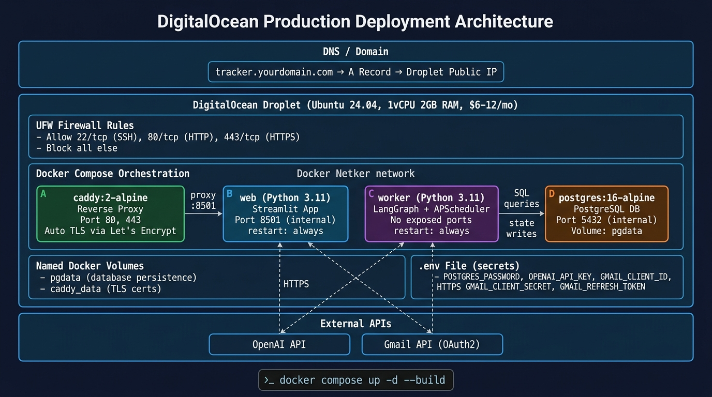

# Autonomous Career Pipeline Engine — System Design

> **Project Codename:** JobTracker
> **Author:** Senior Systems Engineer
> **Date:** September 2026
> **Version:** 2.0 — updated post design review

---

## Table of Contents

1. [Problem Statement](#1-problem-statement)
2. [System Architecture Overview](#2-system-architecture-overview)
3. [Component Design](#3-component-design)
4. [Email Ingestion Pipeline — Gmail Filter Strategy](#4-email-ingestion-pipeline--gmail-filter-strategy)
5. [LangGraph Agent — State Machine Design](#5-langgraph-agent--state-machine-design)
6. [Entity Resolution — Full Fallback Chain](#6-entity-resolution--full-fallback-chain)
7. [Application State Machine — Transition Graph](#7-application-state-machine--transition-graph)
8. [RAG Pipeline — Resume Matching Engine](#8-rag-pipeline--resume-matching-engine)
9. [Technology Stack](#9-technology-stack)
10. [Database Schema](#10-database-schema)
11. [Functional Requirements](#11-functional-requirements)
12. [Standout Engineering Requirements](#12-standout-engineering-requirements)
13. [Critical User Journeys (CUJs)](#13-critical-user-journeys-cujs)
14. [Deployment Architecture — DigitalOcean](#14-deployment-architecture--digitalocean)
15. [Engineering Decisions & Tradeoffs](#15-engineering-decisions--tradeoffs)

---

## 1. Problem Statement

High-volume job seekers applying across multiple platforms (Naukri, LinkedIn, company career portals) face three compounding problems:

1. **No unified state tracking.** Applications scatter across a spreadsheet, email inbox, and memory. There is no single source of truth for where each application stands.
2. **Resume version chaos.** When 4 slightly different resume versions are submitted to 50 companies, there is no reliable way to recall which version went to which company — a critical gap when an interviewer asks about a specific bullet point you may or may not have included.
3. **Silent portals.** Platforms like Naukri do not send confirmation emails on every application. Manual entry is the only option, creating friction that breaks the habit.

The goal is to **eliminate all manual bookkeeping** while making the AI the functional engine — not decorative.

---

## 2. System Architecture Overview

The system is a **hybrid event-driven pipeline** deployed across two tiers: a React frontend on Vercel's global CDN and a containerized backend on a single DigitalOcean VPS. It separates synchronous user-triggered actions (manual JD paste, direct status overrides) from asynchronous background processing (daily Gmail polling and state progression), while sharing a single PostgreSQL database as the source of truth.


*Figure 1: High-level system architecture — React frontend on Vercel, FastAPI + Worker + PostgreSQL on a single DigitalOcean Droplet behind Caddy*

### Architectural Principle: Why a Monolith?

A microservices architecture would introduce service mesh complexity, inter-service authentication, and distributed tracing overhead that is grossly disproportionate to a single-user system. Docker Compose provides **process isolation** (if the background worker crashes, the web UI stays alive) without the operational burden of Kubernetes or service registries.

---

## 3. Component Design

### 3.1 Ingress Layer — Caddy 2

**Role:** Single entry point for API traffic on the DigitalOcean Droplet.

**Responsibilities:**
- Automatic TLS certificate provisioning and renewal via Let's Encrypt
- Reverse proxy from `api.yourdomain.com` to the internal FastAPI container on port `8000`
- Implicit edge firewall — only ports 80 and 443 are externally reachable

**Caddyfile (production):**
```caddyfile
api.yourdomain.com {
    reverse_proxy web:8000
}
```

> **Note:** The React frontend is served entirely by Vercel's CDN — Caddy on the Droplet never handles React static file serving. The domain split is: `relay.yourdomain.com` → Vercel, `api.yourdomain.com` → DigitalOcean Droplet.

**Design Decision:** Caddy over Nginx eliminates manual SSL configuration, which is a common deployment failure point.

---

### 3.2 User Interface Layer — React + Vite + Tailwind CSS

**Deployment:** Vercel (free tier, global CDN, automatic HTTPS)
**Repository:** separate repo; communicates with the backend exclusively via HTTP API calls to `api.yourdomain.com`

**Responsibilities:**
- **Kanban Pipeline Dashboard:** cards grouped by `current_status`, powered by `GET /api/applications`
- **New Drop View:** JD textarea → "Parse & Tailor Resume" (`POST /api/applications/parse`) → editable Markdown resume panel → "Confirm & Save" (`PATCH /api/applications/{id}/resume`)
- **Application Detail Drawer:** slide-in panel showing full `pipeline_events` audit timeline, active resume snapshot, and all update controls
- **Direct Status Override:** dropdown of valid next states + optional note → `PATCH /api/applications/{id}/status` (zero LLM, no DAG validation)
- **Portal Text Drop:** paste recruiter/portal message → AI-parsed → `POST /api/applications/{id}/text-update`
- **Ambiguous Match Banner:** surfaces unresolved emails with assign/dismiss buttons
- **Stats Bar:** live counts via `GET /api/metrics`

**Tech Stack:**
| Library | Role |
|---|---|
| React 18 + Vite | UI framework + build tool |
| Tailwind CSS | utility-first styling |
| shadcn/ui | accessible component primitives |
| TanStack Router | file-based client-side routing |
| sonner | toast notifications |

**Design Decision:** React on Vercel gives zero-cost, zero-maintenance static hosting with a global CDN and automatic HTTPS. The FastAPI backend on DigitalOcean is fully decoupled — it can serve any frontend without code changes.

---

### 3.3 API Layer — FastAPI

**Role:** Public API surface. Exposed through Caddy at `api.yourdomain.com`. Called exclusively by the React frontend over HTTPS.

**Responsibilities:**

**Extraction Service**
- Receives raw text (JD dump or update snippet)
- Calls LLM via `Instructor + Pydantic` to extract structured fields
- Runs self-repair loop (up to 3 retries) on schema validation failures
- Circuit breaker: if all 3 retries fail, returns a structured failure response — never raises an unhandled exception

**RAG Engine**
- Embeds JD requirements via `text-embedding-3-small`
- Cosine similarity search against `master_experience_vault`
- Injects top-5 bullets into a strict template prompt
- Runs hallucination guard before returning the snapshot

**State Controller**
- Accepts a validated `JobEvent` (from worker or UI)
- Validates the transition against the non-linear DAG (see Section 7)
- Handles `APPLICATION_RECEIVED` event type: logs confirmation but does not change `current_status`
- Writes to `applications` and appends immutable row to `pipeline_events`
- Supports `MANUAL_OVERRIDE` source: bypasses transition validation for force corrections

---

### 3.4 Background Ingestion Worker — Python Process

**Role:** Autonomous daily agent. Runs at 08:00 every morning independent of user action.

**Responsibilities:**
- Reads `last_checked_at` from the `worker_config` table at startup
- Executes a two-layer filtered Gmail API query (see Section 4)
- For each email that passes the filter, runs the full LangGraph agent pipeline (see Section 5)
- Updates `last_checked_at` in `worker_config` only after a fully committed transaction
- Dead-letter logs irrelevant and failed emails for audit

**Scheduling:** APScheduler `CronTrigger` fires at `hour=8, minute=0`. This is a deliberate choice over the earlier 15-minute interval — application status emails are not time-critical to the minute, and once-daily polling reduces OpenAI API cost and Gmail quota consumption by 96%.

**Process Isolation Guarantee:** Separate Docker container with `restart: always`. Gmail API rate limits or network failures restart the container without touching the Streamlit UI.

---

### 3.5 Persistence Layer — PostgreSQL 16

**Role:** Single source of truth for all state.

**Key Design Choices:**
- `canonical_company_name` is separate from `company_name`. Raw name is preserved for audit; normalized name is the deduplication key.
- `pipeline_events` is **append-only**. No updates, no deletes. Complete immutable timeline.
- `role_title NOT NULL` on `applications` — manual drops always have the role from the JD. Null role is only a problem in email parsing, handled in `ParsedEmailEvent` Pydantic model.
- `pgvector` with `IVFFlat` index enables sub-millisecond cosine similarity as the vault grows.
- `worker_config` key-value table persists operational state (e.g., `last_checked_at`) across container restarts.

---

## 4. Email Ingestion Pipeline — Gmail Filter Strategy

### The Core Problem with Domain-Based Filtering

Domain filtering was the initial approach and was discarded after examining real-world email data. The reason: **you cannot predict custom company HR domains in advance.**

Real confirmation emails arrive from:
- `hr@zyntrixsoftware.com` — custom company domain
- `careers@recruiting.uhg.com` — custom recruiting subdomain
- `noreply@mail.amazon.jobs` — custom `.jobs` TLD

No predefined ATS domain list catches these. Meanwhile, known ATS domains (e.g., `careers.trinet.com`) also send promotional job recommendation emails — meaning domain filtering produces both false negatives AND false positives simultaneously.

### Design Decision: Subject-First, Two-Layer Architecture

The filter is built in two stages with clearly separated responsibilities:

| Layer | Tool | Goal | Optimise For |
|---|---|---|---|
| Layer 1 | Gmail API query | Pre-filter the inbox | **Recall** — catch everything that might be job-related |
| Layer 2 | LLM Relevance Gate | Classify intent | **Precision** — determine if this is a confirmed application event |

### Layer 1: Gmail Query Construction

```python
POSITIVE_SUBJECT_TERMS = [
    '"application received"',
    '"thank you for applying"',
    '"thank you for your application"',
    '"your application"',
    '"we have received your application"',
    '"keep track of your application"',
    '"you applied for 1 job"',   # Naukri single-application summary
    'interview',
    'assessment',
    '"offer letter"',
    '"next steps"',
]

NEGATIVE_SUBJECT_TERMS = [
    '"apply now"',
    '"invited to apply"',
    '"is a match"',
    '"job alert"',
    '"jobs for you"',
    '"saved job"',
    '"recommended for you"',
    '"perfect match"',
    '"see what employees have to say"',  # AmbitionBox review nudges
    '"security code"',                   # Greenhouse OTP emails
    '"verify your identity"',            # Amex and similar identity checks
    '"verification code"',
    '"one-time passcode"',
    '"confirm your identity"',
    '"passcode"',
]

BLOCKED_SENDERS = [
    'ambitionbox.com',   # review nudges triggered by Naukri applications
]

def build_gmail_query(last_checked_at: datetime) -> str:
    ts = int(last_checked_at.timestamp())
    positive = " OR ".join(f"subject:{t}" for t in POSITIVE_SUBJECT_TERMS)
    negative = " ".join(f"-subject:{t}" for t in NEGATIVE_SUBJECT_TERMS)
    blocked  = " ".join(f"-from:{d}" for d in BLOCKED_SENDERS)

    return f"after:{ts} ({positive}) {negative} {blocked}"
```

The `-` prefix in Gmail queries means NOT. Negative subject filters take precedence, so even if an email like Greenhouse's *"Security code for **your application**..."* hits the positive `subject:"your application"` pattern, the `-subject:"security code"` excludes it before the API returns it.

### Layer 2: LLM Relevance Gate

A fast, cheap classification call executed on the first 1000 characters of each email that passes Layer 1. This is the true precision layer.

```python
RELEVANCE_GATE_PROMPT = """
You are a filter for a job application tracking system.

Decide: is this email evidence that the user has ALREADY submitted a job application?

MARK AS RELEVANT (is_relevant: true):
- Application receipt confirmations ("We have received your application", "Application Received")
- Interview invitations for a role the user applied to
- Online assessment / coding test invitations (HackerRank, HackerEarth, Mercer Mettl, Codility, etc.)
- Rejection emails ("we've decided to move forward with other candidates",
  "we will keep your profile on file", "regret to inform")
- Offer letters or compensation discussions
- "Next steps" emails following a submitted application
- Naukri "You applied for 1 job" emails IF the body contains a specific job title and company

MARK AS NOT RELEVANT (is_relevant: false):
- Emails inviting you TO apply (you have not applied yet)
- Job recommendation emails ("this job is a match", "based on your profile")
- Saved job reminders
- Recruiter cold outreach
- Naukri "You applied for N jobs" emails where body is empty or contains only a count
- AmbitionBox review nudges
- OTP / security code / identity verification emails — these are sent WHILE filling out
  the application form, before submission is confirmed. The presence of a short
  alphanumeric code (e.g. 'vQuSydKU', '595125') with "resubmit" or "expires in 10 minutes"
  is a definitive signal.

The single clearest signal: RELEVANT emails confirm something you ALREADY DID.
NOT RELEVANT emails are asking you to DO something, or sent mid-form before submission.
"""
```

---

## 5. LangGraph Agent — State Machine Design

The Background Worker runs a **LangGraph stateful graph** per email. LangGraph was chosen because the pipeline is not a straight chain — it requires conditional branching, cyclic retry loops, and shared state across nodes.


*Figure 2: Updated LangGraph agent — Node 0 (Relevance Gate) now precedes all processing*

### Updated Graph State

```python
class AgentState(BaseModel):
    raw_email_text: str
    email_received_at: datetime
    is_relevant: bool = False                   # set by Node 0
    parsed_event: Optional[ParsedEmailEvent] = None
    validation_errors: list[str] = []
    retry_count: int = 0
    matched_application_id: Optional[str] = None
    resolution_confidence: str = "NONE"         # "HIGH" | "LOW" | "AMBIGUOUS" | "NONE"
    resolution_note: str = ""
    is_new_application: bool = False
    status_changed: bool = False
    committed: bool = False
```

### Node Descriptions (Updated)

| Node | Input | Output | Failure / Edge |
|---|---|---|---|
| `gmail_poller` | `last_checked_at` timestamp | list of raw email strings | Gmail API rate limit → retry with backoff |
| **`relevance_gate`** *(new)* | raw email text (first 1000 chars) | `is_relevant: bool` | NOT relevant → `dead_letter_log`, stop |
| `extract_event` | raw email text | `ParsedEmailEvent` schema | Schema failure → `self_repair` |
| `validate_schema` | `ParsedEmailEvent` | pass/fail + error detail | Invalid → `self_repair` |
| `self_repair` | validation error + original text | corrected `ParsedEmailEvent` | Max 3 retries → `dead_letter_log` |
| `entity_resolution` | `company_raw`, `role_title`, `email_received_at` + active DB records | `application_id` or `None` or `"AMBIGUOUS"` | See Section 6 |
| `state_transition` | `application_id` + `event_type` | Updated status | `APPLICATION_RECEIVED` → no status change, just log |
| `create_new_record` | extracted metadata | New `application_id` | Duplicate key → merge existing |
| `flag_for_manual` *(new)* | AMBIGUOUS state | Dashboard notification | None |
| `commit_and_log` | final state | Appended `pipeline_events` row | DB timeout → retry once |
| `dead_letter_log` | failed state | Logged to error table | None |

### ParsedEmailEvent Schema

```python
class ApplicationEventType(str, Enum):
    APPLICATION_RECEIVED = "APPLICATION_RECEIVED"  # receipt confirmation — no state change
    OA_RECEIVED          = "OA_RECEIVED"
    INTERVIEW_INVITE     = "INTERVIEW_INVITE"
    OFFER                = "OFFER"
    REJECTED             = "REJECTED"

class ParsedEmailEvent(BaseModel):
    company_raw: str
    role_title: Optional[str] = None   # None when not explicitly stated — DO NOT infer
    event_type: ApplicationEventType
    deadline: Optional[str] = None     # ISO 8601 if a deadline is mentioned
```

**Critical extraction rule:** `role_title` must be extracted only if a specific job title is explicitly present in the email. If the email says *"the position"* or *"a role"* without naming it, return `null`. The LLM must not infer or hallucinate the role from the company name or other context.

---

## 6. Entity Resolution — Full Fallback Chain

This is the most complex single component in the system. The goal is to map an inbound email (which may use a legal entity name, a parent company name, or no role information at all) to the correct existing application record.

```
company match
    │
    ├── 0 matches ──────────────────────────────────► CREATE NEW record
    │
    ├── 1 match ────────────────────────────────────► UPDATE (HIGH confidence)
    │
    └── N matches (multiple roles at same company)
            │
            ├── role_title known
            │       │
            │       ├── role fuzzy match found ──────► UPDATE (HIGH confidence)
            │       └── role fuzzy match fails ──────► LLM arbitration
            │               │
            │               ├── LLM resolves ────────► UPDATE (HIGH confidence)
            │               └── LLM returns AMBIGUOUS► flag_for_manual node
            │
            └── role_title is None (email didn't mention it)
                    │
                    ├── email_received_at within 24h of applied_at ► UPDATE (LOW confidence, flagged on UI)
                    └── gap ≥ 24h ────────────────────────────────► flag_for_manual node
```

### Level 1 — Normalized Company Name (Fuzzy String Match)

```python
def normalize_company_name(name: str) -> str:
    # Strip legal suffixes that don't carry identity signal
    suffixes = ["pvt ltd", "private limited", "ltd", "inc", "corp",
                "technologies", "solutions", "services", "group"]
    name = name.lower().strip()
    for suffix in suffixes:
        name = name.replace(suffix, "").strip().rstrip(",").strip()
    return name

# Levenshtein normalized similarity threshold: 0.85
```

### Level 2 — LLM Arbitration (Holding Company / Subsidiary Resolution)

Fires when fuzzy score < 0.85 OR when multiple candidates remain after role matching.

```python
DISAMBIGUATION_PROMPT = """
Multiple active applications exist. Determine which one this email belongs to.

Email data:
  Company mentioned: "{company_raw}"
  Role mentioned: "{role_raw}" (may be null)

Active applications:
{applications_list}

Return the application_id that matches, or "NEW" if this is a new application
for a different role, or "AMBIGUOUS" if you cannot determine this with confidence.
Do NOT guess. If uncertain, return "AMBIGUOUS".
"""
```

`"AMBIGUOUS"` routes to `flag_for_manual` — the email body is surfaced in the dashboard so the user resolves it in one tap.

### Level 3 — Date Proximity Fallback (Role Missing)

When `role_title` is `None` and there are multiple candidates:

```python
closest = min(
    company_candidates,
    key=lambda app: abs((email_received_at - app.applied_at).total_seconds())
)
gap_seconds = abs((email_received_at - closest.applied_at).total_seconds())

if gap_seconds < 86400:  # 24 hours
    return Resolution(
        match=closest,
        action="UPDATE",
        confidence="LOW",
        note="Role absent from email; matched by date proximity"
    )
else:
    return Resolution(action="AMBIGUOUS")
```

Low-confidence matches are surfaced with a ⚠️ badge on the application card with a one-tap confirm/reassign control.

### Handling APPLICATION_RECEIVED Without Duplication

When a user manually drops a Naukri JD and later the Naukri "You applied for 1 job" email arrives:

1. Entity resolution finds the existing record (company + date match) → UPDATE
2. `state_transition` node detects: `current_status == APPLIED`, `event_type == APPLICATION_RECEIVED`
3. **No status change** — `applications.current_status` remains `APPLIED`
4. `commit_and_log` still inserts a `pipeline_events` row: `from_status = APPLIED`, `to_status = APPLIED`, `source = GMAIL_WORKER`, `note = "Application receipt confirmed by Naukri"`

This preserves the audit trail without corrupting state.

---

## 7. Application State Machine — Transition Graph

The original linear chain (`APPLIED → OA_PENDING → INTERVIEW_ROUND → OFFER/REJECTED`) was replaced with a **directed acyclic graph (DAG)** after reviewing real-world hiring patterns.

**Why the linear chain is wrong:**
- Companies frequently skip OA and go straight to interview (`APPLIED → INTERVIEW_ROUND`)
- Multiple interview rounds are the norm, not the exception (`INTERVIEW_ROUND → INTERVIEW_ROUND`)
- Offers can be rescinded (`OFFER → REJECTED`)
- The user can withdraw at any point

### Valid Transition Map

```python
VALID_TRANSITIONS: dict[str, list[str]] = {
    "APPLIED": [
        "OA_PENDING",        # standard pipeline
        "INTERVIEW_ROUND",   # company skips OA — common
        "OFFER",             # fast-track / referral
        "REJECTED",
        "WITHDRAWN"
    ],
    "OA_PENDING": [
        "INTERVIEW_ROUND",   # passed OA
        "OFFER",             # rare
        "REJECTED",          # failed OA or no response
        "WITHDRAWN"
    ],
    "INTERVIEW_ROUND": [
        "INTERVIEW_ROUND",   # next round — does NOT change status, logs new event
        "OFFER",
        "REJECTED",
        "WITHDRAWN"
    ],
    "OFFER": [
        "REJECTED",          # offer rescinded by company
        "WITHDRAWN"          # candidate declines
    ],
    "REJECTED": [],          # terminal
    "WITHDRAWN": []          # terminal
}
```

### Repeating INTERVIEW_ROUND

`INTERVIEW_ROUND → INTERVIEW_ROUND` does not change `applications.current_status`. It inserts a new `pipeline_events` row. The round context is captured in `raw_payload`:

```sql
-- Round 1:
INSERT INTO pipeline_events (from_status, to_status, source, raw_payload)
VALUES ('APPLIED', 'INTERVIEW_ROUND', 'GMAIL_WORKER', 'Round 1: Technical screen scheduled...')

-- Round 2 (same status, new event):
INSERT INTO pipeline_events (from_status, to_status, source, raw_payload)
VALUES ('INTERVIEW_ROUND', 'INTERVIEW_ROUND', 'GMAIL_WORKER', 'Round 2: System design with VP Engineering...')
```

The timeline on the detail card shows all rounds in chronological order. No additional column needed.

### Force Override (Backward Transitions)

The standard `state_transition` node enforces `VALID_TRANSITIONS`. The `MANUAL_OVERRIDE` source bypasses this check entirely, allowing the user to set any status to correct a wrong auto-classification. This path is only reachable via the "Force Override (advanced)" expander in the UI — intentionally de-emphasized.

---

## 8. RAG Pipeline — Resume Matching Engine

The resume generation pipeline is a **Constraint-Based RAG**. The retrieval step is a hard guardrail — the LLM acts only as a formatter, never as a creative writer.

```
[JD Text]
    │
    ▼
[Embed JD Requirements Section]  ← text-embedding-3-small
    │
    ▼
[Cosine Similarity Search]  ← pgvector IVFFlat index on master_experience_vault
    │
    ▼
[Top-5 Bullet Points Retrieved]
    │
    ▼
[LLM Template Formatter]
    ← System prompt: "Use ONLY the provided bullets. Do not invent any technology,
       metric, or tool not explicitly present in the source context."
    │
    ▼
[Hallucination Guard]
    ← Deterministic token cross-check: every tech term and metric in generated output
       must appear verbatim in the retrieved bullets
    │
    ├── PASS → render in Streamlit text_area → user edits → save snapshot
    └── FAIL → force regeneration with correction prompt (max 2 attempts)
               → if still failing, flag for manual review
```

---

## 9. Technology Stack

| Layer | Technology | Version | Rationale |
|---|---|---|---|
| **UI** | Streamlit | 1.35+ | Zero frontend overhead; native `st.text_area` + `st.markdown`; mobile browser compatible |
| **Internal API** | FastAPI | 0.111+ | Async request handling; native Pydantic v2 integration |
| **Task Scheduler** | APScheduler (`CronTrigger`) | 3.10+ | Daily cron at 08:00; no external broker needed at single-user scale |
| **Agent Framework** | LangGraph | 0.2+ | Cyclic graphs, conditional edges, shared state — required for retry loops and multi-path entity resolution |
| **LLM Orchestration** | Instructor + Pydantic v2 | Latest | Deterministic JSON schema compliance; automatic client-side retry on validation failure |
| **Inference Model** | OpenAI `gpt-4o-mini` | — | <2s latency, \$0.15/1M tokens; used for extraction, relevance gate, and entity arbitration |
| **Embeddings** | OpenAI `text-embedding-3-small` | — | 1536-dim; 5–10x cheaper than large with negligible quality loss for this retrieval task |
| **Database** | PostgreSQL 16 | Alpine | ACID; JSONB; `pgvector` for native vector search |
| **ORM + Migrations** | SQLAlchemy 2.0 + Alembic | Latest | Typed async ORM; migration versioning for safe schema changes |
| **Reverse Proxy** | Caddy 2 | Alpine | Automatic Let's Encrypt TLS; zero SSL config |
| **Containerization** | Docker + Docker Compose v2 | Latest | Process isolation; `restart: always` on worker |
| **Host** | DigitalOcean Droplet | Ubuntu 24.04 | 1 vCPU / 2 GB RAM / \$12/mo; flat pricing; no data-expiry risk |
| **Gmail Integration** | Google Gmail API (OAuth2) | v1 | Headless refresh token auth; server-side search query execution |
| **Entity Resolution** | `python-Levenshtein` | Latest | Normalized edit distance for Level 1 company name fuzzy matching |
| **Eval Harness** | `pytest` | Latest | Ground-truth test set of 30+ real-world ATS emails |

---

## 10. Database Schema


*Figure 3: Entity-relationship diagram — PostgreSQL 16 schema*

### PostgreSQL DDL

```sql
-- ============================================================
-- ENUM TYPES
-- ============================================================

CREATE TYPE application_status AS ENUM (
    'APPLIED',
    'OA_PENDING',
    'INTERVIEW_ROUND',
    'OFFER',
    'REJECTED',
    'WITHDRAWN'
);

CREATE TYPE event_source AS ENUM (
    'MANUAL_DROP',      -- user pasted text into JD drop or Stage Update Drop; AI classified
    'GMAIL_WORKER',     -- automated background email processing
    'MANUAL_OVERRIDE'   -- direct user action via status dropdown; no AI involved
);

-- ============================================================
-- TABLE: applications
-- Central record for a single job application.
-- role_title is NOT NULL — manual drops always have the role
-- from the JD text. Null role is only a problem in email
-- parsing and is handled at the Pydantic model layer, not here.
-- ============================================================

CREATE TABLE applications (
    id                      UUID PRIMARY KEY DEFAULT gen_random_uuid(),
    company_name            VARCHAR(255) NOT NULL,
    canonical_company_name  VARCHAR(255) NOT NULL,    -- normalized for dedup lookups
    role_title              VARCHAR(255) NOT NULL,
    source_platform         VARCHAR(100) NOT NULL DEFAULT 'Direct',
    job_description_raw     TEXT,
    primary_tech_stack      JSONB        NOT NULL DEFAULT '[]'::jsonb,
    experience_required_yrs DECIMAL(3,1),
    location                VARCHAR(255),
    current_status          application_status NOT NULL DEFAULT 'APPLIED',
    applied_at              TIMESTAMPTZ  NOT NULL DEFAULT NOW(),
    updated_at              TIMESTAMPTZ  NOT NULL DEFAULT NOW()
);

CREATE INDEX idx_applications_canonical_name ON applications(canonical_company_name);
CREATE INDEX idx_applications_status         ON applications(current_status);
CREATE INDEX idx_applications_applied_at     ON applications(applied_at DESC);

-- ============================================================
-- TABLE: resume_snapshots
-- The exact resume version generated/submitted per application.
-- is_active marks the current version when multiple exist.
-- ============================================================

CREATE TABLE resume_snapshots (
    id                  UUID PRIMARY KEY DEFAULT gen_random_uuid(),
    application_id      UUID NOT NULL REFERENCES applications(id) ON DELETE CASCADE,
    markdown_content    TEXT NOT NULL,
    retrieved_vault_ids JSONB NOT NULL DEFAULT '[]'::jsonb,
    is_user_edited      BOOLEAN NOT NULL DEFAULT FALSE,
    is_active           BOOLEAN NOT NULL DEFAULT TRUE,
    created_at          TIMESTAMPTZ NOT NULL DEFAULT NOW(),
    updated_at          TIMESTAMPTZ NOT NULL DEFAULT NOW()
);

CREATE INDEX idx_resume_snapshots_app_id ON resume_snapshots(application_id);

-- ============================================================
-- TABLE: pipeline_events
-- Append-only audit log of every state event.
-- NEVER update or delete rows in this table.
-- NOTE: from_status == to_status is valid and intentional for:
--   - INTERVIEW_ROUND → INTERVIEW_ROUND (next round)
--   - APPLICATION_RECEIVED confirmation (status stays APPLIED)
-- ============================================================

CREATE TABLE pipeline_events (
    id                UUID PRIMARY KEY DEFAULT gen_random_uuid(),
    application_id    UUID NOT NULL REFERENCES applications(id) ON DELETE CASCADE,
    from_status       application_status,
    to_status         application_status NOT NULL,
    detected_deadline TIMESTAMPTZ,
    source            event_source NOT NULL,
    raw_payload       TEXT NOT NULL,
    resolution_note   TEXT,                      -- entity resolution method used
    llm_confidence    VARCHAR(20),               -- "HIGH" | "LOW" | "AMBIGUOUS"
    created_at        TIMESTAMPTZ NOT NULL DEFAULT NOW()
);

CREATE INDEX idx_pipeline_events_app_id  ON pipeline_events(application_id);
CREATE INDEX idx_pipeline_events_created ON pipeline_events(created_at DESC);

-- ============================================================
-- TABLE: master_experience_vault
-- Candidate's single source of truth for all experience.
-- Bullets here are the ONLY source for resume generation.
-- ============================================================

CREATE EXTENSION IF NOT EXISTS vector;

CREATE TABLE master_experience_vault (
    id           UUID PRIMARY KEY DEFAULT gen_random_uuid(),
    category     VARCHAR(100) NOT NULL CHECK (
                     category IN ('WORK_EXPERIENCE', 'PROJECT', 'SKILL', 'EDUCATION')
                 ),
    title        VARCHAR(255) NOT NULL,
    bullet_point TEXT NOT NULL,
    tech_tags    JSONB NOT NULL DEFAULT '[]'::jsonb,
    embedding    vector(1536),
    created_at   TIMESTAMPTZ NOT NULL DEFAULT NOW()
);

CREATE INDEX idx_vault_embedding ON master_experience_vault
    USING ivfflat (embedding vector_cosine_ops) WITH (lists = 10);

-- ============================================================
-- TABLE: worker_config
-- Key-value store for operational state.
-- Persists last_checked_at across container restarts.
-- ============================================================

CREATE TABLE worker_config (
    key        VARCHAR(100) PRIMARY KEY,
    value      TEXT NOT NULL,
    updated_at TIMESTAMPTZ NOT NULL DEFAULT NOW()
);

-- Seed on first deploy
INSERT INTO worker_config (key, value)
VALUES ('last_checked_at', '2026-09-01T00:00:00+00:00')
ON CONFLICT (key) DO NOTHING;
```

### Schema Design Notes

| Decision | Rationale |
|---|---|
| `UUID` PKs | Prevents ID enumeration; safe for future distributed scenarios |
| `company_name` vs `canonical_company_name` | Raw text preserved for debugging; normalized column is the dedup key |
| `pipeline_events` append-only | Full audit trail; `from_status == to_status` is explicitly valid |
| `resolution_note` + `llm_confidence` in events | Post-hoc debugging of entity resolution decisions |
| `is_active` on snapshots | Versioning without destructive deletes |
| `worker_config` in DB not flat file | Survives container rebuilds; atomic updates with `ON CONFLICT` |

---

## 11. Functional Requirements

| # | Requirement | Priority |
|---|---|---|
| FR-01 | Accept raw unstructured text from any portal and extract: company, role, tech stack, experience, location, platform | P0 |
| FR-02 | Schema validation failures must trigger automated self-repair loop (max 3 retries) with circuit breaker on exhaustion | P0 |
| FR-03 | Generate tailored Markdown resume snapshot using fixed template populated exclusively from retrieved vault bullets | P0 |
| FR-04 | Resume snapshot must be editable in the UI before committing | P0 |
| FR-05 | Saved snapshot must be permanently linked to its specific application record | P0 |
| FR-06 | Background worker must poll Gmail once daily at 08:00 using two-layer filtering (subject keyword query + LLM relevance gate) | P0 |
| FR-07 | Gmail query must use positive subject keywords and negative exclusions. Must NOT rely on ATS domain lists as primary filter | P0 |
| FR-08 | OTP / security code emails must be excluded at the Gmail query layer via negative subject filter | P0 |
| FR-09 | Entity resolution must use a four-level fallback chain: exact fuzzy match → role disambiguation → LLM arbitration → date proximity | P0 |
| FR-10 | When role is absent from email, date proximity fallback must be used; gap ≥ 24h must route to AMBIGUOUS | P0 |
| FR-11 | AMBIGUOUS matches must surface in the dashboard with the full email body for user resolution | P0 |
| FR-12 | State transitions must follow the non-linear DAG; every non-terminal status must be reachable from any earlier status | P0 |
| FR-13 | `INTERVIEW_ROUND → INTERVIEW_ROUND` is a valid event that logs a new `pipeline_events` row without changing `current_status` | P0 |
| FR-14 | `APPLICATION_RECEIVED` event type must log a confirmation row without changing `current_status` | P0 |
| FR-15 | Every application must expose a Direct Status Override control (dropdown + optional note) | P0 |
| FR-16 | A Force Override escape hatch must allow any-state correction for wrong auto-classifications | P1 |
| FR-17 | All raw inputs (JD dumps, email bodies, update snippets, override notes) stored in `pipeline_events` as immutable log | P0 |

---

## 12. Standout Engineering Requirements

| # | Requirement | What it Proves |
|---|---|---|
| SR-01 | **Subject-first Gmail filtering with explicit negative exclusions** — OTP emails, AmbitionBox, promotional content excluded before any LLM call | Layered system design; understanding of recall/precision tradeoffs |
| SR-02 | **Two-stage email filtering** — Gmail query for recall, LLM relevance gate for precision; separation of concerns | Correct problem decomposition |
| SR-03 | **Anti-Hallucination Guardrail** — every technical term in the generated resume cross-checked against retrieved vault bullets | Grounded generation; LLM failure mode awareness |
| SR-04 | **Self-Repair Loop** — Pydantic validation failures fed back to LLM as correction prompts (max 3 retries); circuit breaker on exhaustion | Resilient pipeline; production-grade error handling |
| SR-05 | **Four-level Entity Resolution Chain** — fuzzy string → role disambiguation → LLM arbitration → date proximity → AMBIGUOUS flag | Senior data engineering; record linkage expertise |
| SR-06 | **Non-linear State DAG** — all forward transitions valid; INTERVIEW_ROUND repeatable; MANUAL_OVERRIDE bypass for corrections | Accurate domain modeling vs. idealized linear model |
| SR-07 | **Three ingestion sources cleanly separated** — `MANUAL_DROP`, `GMAIL_WORKER`, `MANUAL_OVERRIDE` — with distinct audit trail entries | Clean taxonomy; traceable provenance on every event |
| SR-08 | **Offline Evaluation Harness** — pytest against 30+ ground-truthed real ATS emails; reports Stage Classification Accuracy, Entity Extraction Precision, Schema Repair Recovery Rate | Evidence-based engineering; portfolio-ready hard metrics |
| SR-09 | **Headless OAuth** — Gmail credentials from environment variables; zero browser re-authentication on server | Real production deployment, not "works on localhost" |
| SR-10 | **Process Isolation** — background worker in separate container with `restart: always` | Operational maturity; failure domain separation |

---

## 13. Critical User Journeys (CUJs)

### CUJ-1: Mobile Naukri Application Ingestion (Manual Path)

**Trigger:** Applied on Naukri mobile. No email confirmation.

```
1. User copies raw JD text from Naukri app
2. Opens tracker in mobile browser → pastes into "Job Description Drop" → "Parse & Tailor Resume"
3. Extraction Service: Instructor extracts {company, role, tech_stack, experience, platform}
4. RAG Engine: embeds JD requirements → cosine similarity → top-5 vault bullets retrieved
5. LLM formats Markdown resume using ONLY retrieved bullets
6. Hallucination Guard runs → PASS
7. UI renders: extracted metadata card + pre-filled Markdown textarea
8. User edits one bullet → "Confirm & Save"
9. DB: INSERT applications (status: APPLIED), INSERT resume_snapshots (is_user_edited: TRUE),
        INSERT pipeline_events (to_status: APPLIED, source: MANUAL_DROP)
```

---

### CUJ-2: Automated ATS Email → State Traversal

**Trigger:** Greenhouse OA invite arrives the next morning.

```
1. APScheduler fires at 08:00
2. Gmail API query executed server-side with positive/negative subject filters
3. Greenhouse email passes query (subject contains "assessment")
   OTP email from Greenhouse blocked by -subject:"security code"
4. LangGraph Node 0 — Relevance Gate: is_relevant = TRUE
5. Node 1 — Extract Event: {company_raw: "Squarepoint Capital", role_title: null,
   event_type: OA_RECEIVED, deadline: "2026-09-20T23:59:00"}
6. Node 2 — Validate Schema: PASS (role_title is null — expected and valid)
7. Node 3 — Entity Resolution:
   - 1 active application at "Squarepoint Capital" → HIGH confidence match
8. Node 4 — State Transition:
   - VALID_TRANSITIONS["APPLIED"] includes "OA_PENDING" → proceed
   - UPDATE applications SET current_status = 'OA_PENDING'
9. Node 5 — Commit & Log:
   - INSERT pipeline_events (from: APPLIED, to: OA_PENDING, source: GMAIL_WORKER,
     detected_deadline: "2026-09-20", raw_payload: <full email body>)
10. worker_config.last_checked_at updated
```

---

### CUJ-3: Ambiguous Entity — Multiple Roles at Same Company

**Trigger:** Interview invite email arrives for "Swiggy" — two active applications exist (SDE-1 and Backend Engineer). Role not mentioned in email.

```
1. Gmail filter passes email (subject: "next steps regarding your application")
2. Relevance Gate: is_relevant = TRUE
3. Extract Event: {company_raw: "Swiggy", role_title: null, event_type: INTERVIEW_INVITE}
4. Entity Resolution:
   - 2 candidates: Swiggy SDE-1 (applied Sep 5), Swiggy Backend Engineer (applied Sep 8)
   - role_title is None → date proximity fallback
   - email_received_at = Sep 10, gap to SDE-1 = 5 days, gap to Backend = 2 days
   - 2 days < 24h threshold? No — routes to AMBIGUOUS
5. flag_for_manual node: creates dashboard notification
6. Dashboard shows: "❓ Unresolved email from Swiggy — 2 active applications found"
   [Assign to SDE-1] [Assign to Backend Engineer] [Create New]
7. User taps "Assign to Backend Engineer"
8. State transition and commit proceed normally
```

---

### CUJ-4: Phone Call → Direct Status Override

**Trigger:** HR calls to say interview is scheduled. No email, no portal message.

```
1. User opens Swiggy SDE-1 detail card on dashboard
2. Status dropdown shows valid next states: [OA_PENDING, INTERVIEW_ROUND, REJECTED, WITHDRAWN]
3. User selects "INTERVIEW_ROUND"
4. Note field: "Got a call from HR, interview Sep 22 2pm Google Meet"
5. Clicks "Apply Override"
6. DB: UPDATE applications SET current_status = 'INTERVIEW_ROUND'
        INSERT pipeline_events (from: APPLIED, to: INTERVIEW_ROUND,
        source: MANUAL_OVERRIDE, raw_payload: "Got a call from HR...")
7. No LLM called. Zero API cost.
```

---

### CUJ-5: Reviewing Resume Snapshot Before Interview

**Trigger:** Interview in 2 hours. User needs to recall which bullets they highlighted.

```
1. User opens tracker → navigates to company detail card
2. Detail view renders:
   - Current status: INTERVIEW_ROUND
   - Stage history: APPLIED (Sep 5) → INTERVIEW_ROUND (Sep 22, MANUAL_OVERRIDE)
   - Resume snapshot: Markdown rendered inline via st.expander
3. User reads exact bullet points submitted
4. Walks into interview prepared
```

---

## 14. Deployment Architecture — Split Tier (Vercel + DigitalOcean)

The system utilizes a modern split-tier deployment architecture:
1. **Frontend Tier (Vercel):** React + Vite SPA deployed on Vercel's global CDN with automated edge TLS and zero-maintenance continuous delivery.
2. **Backend & Worker Tier (DigitalOcean):** Containerized FastAPI backend, LangGraph background worker, PostgreSQL 16 (`pgvector`), and Caddy reverse proxy orchestrated via Docker Compose on a single Ubuntu 24.04 Droplet.


*Figure 4: Production split deployment — React SPA on Vercel, 4 Docker containers on DigitalOcean Droplet behind Caddy*

---

### 14.1 Frontend Tier: Vercel

The React frontend (`subham3604/pixel-perfect-render-1659`) connects directly to GitHub for automated previews and production deployments.

#### Frontend Environment Variables (Vercel Project Settings)

| Variable | Description | Example / Default |
|---|---|---|
| `VITE_API_URL` | Base public URL of the backend FastAPI service | `https://api.yourdomain.com` (or `http://localhost:8000` for local dev) |

---

### 14.2 Backend Tier: DigitalOcean Droplet

#### Host Specification

| Attribute | Value |
|---|---|
| Provider | DigitalOcean |
| Plan | Basic Droplet |
| CPU / RAM | 1 vCPU / 2 GB |
| Storage | 50 GB SSD |
| OS | Ubuntu 24.04 LTS |
| Cost | ~\$12/month |
| Region | BLR1 (Bangalore) |

#### Backend Environment Variables (`/opt/ai-job-tracker/.env`)

| Variable | Description | Purpose |
|---|---|---|
| `POSTGRES_PASSWORD` | Strong random secret for Postgres | Secures DB container |
| `DATABASE_URL` | SQLAlchemy connection string | `postgresql://tracker_admin:${POSTGRES_PASSWORD}@db:5432/job_tracker` |
| `OPENAI_API_KEY` | OpenAI API Secret Key (`sk-...`) | LLM extraction, relevance gate, and RAG embeddings (`text-embedding-3-small`) |
| `GMAIL_CLIENT_ID` | Google Cloud Console OAuth Client ID | Gmail API email poller |
| `GMAIL_CLIENT_SECRET` | Google Cloud Console OAuth Client Secret | Gmail API token refresh |
| `GMAIL_REFRESH_TOKEN` | Long-lived OAuth2 Refresh Token | Headless server background authorization |

#### docker-compose.yml

```yaml
services:
  caddy:
    image: caddy:2-alpine
    restart: always
    ports:
      - "80:80"
      - "443:443"
    volumes:
      - ./Caddyfile:/etc/caddy/Caddyfile
      - caddy_data:/data
      - caddy_config:/config
    depends_on: [web]
    networks: [tracker-net]

  db:
    image: pgvector/pgvector:pg16
    restart: always
    environment:
      POSTGRES_DB: job_tracker
      POSTGRES_USER: tracker_admin
      POSTGRES_PASSWORD: ${POSTGRES_PASSWORD}
    volumes:
      - postgres_data:/var/lib/postgresql/data
    networks: [tracker-net]
    healthcheck:
      test: ["CMD-SHELL", "pg_isready -U tracker_admin -d job_tracker"]
      interval: 10s
      timeout: 5s
      retries: 5

  web:
    build:
      context: .
      dockerfile: web/Dockerfile
    restart: always
    environment:
      - DATABASE_URL=postgresql://tracker_admin:${POSTGRES_PASSWORD}@db:5432/job_tracker
      - OPENAI_API_KEY=${OPENAI_API_KEY}
    networks: [tracker-net]
    depends_on:
      db:
        condition: service_healthy

  worker:
    build:
      context: .
      dockerfile: worker/Dockerfile
    restart: always
    environment:
      - DATABASE_URL=postgresql://tracker_admin:${POSTGRES_PASSWORD}@db:5432/job_tracker
      - OPENAI_API_KEY=${OPENAI_API_KEY}
      - GMAIL_CLIENT_ID=${GMAIL_CLIENT_ID}
      - GMAIL_CLIENT_SECRET=${GMAIL_CLIENT_SECRET}
      - GMAIL_REFRESH_TOKEN=${GMAIL_REFRESH_TOKEN}
    networks: [tracker-net]
    depends_on:
      db:
        condition: service_healthy

volumes:
  postgres_data:
  caddy_data:
  caddy_config:

networks:
  tracker-net:
    driver: bridge
```

#### Caddyfile (DigitalOcean)

```caddyfile
api.yourdomain.com {
    reverse_proxy web:8000
}
```

#### Deployment Runbook

```bash
# 1. Provision: Ubuntu 24.04, 2GB RAM, BLR1 region. Point A record (api.yourdomain.com) to Droplet IP.

# 2. Server setup
ssh root@<DROPLET_IP>
apt update && apt install -y docker.io docker-compose-v2
systemctl enable --now docker
ufw allow 22/tcp && ufw allow 80/tcp && ufw allow 443/tcp && ufw enable

# 3. Clone and configure
git clone https://github.com/yourusername/ai-job-tracker.git /opt/ai-job-tracker
cd /opt/ai-job-tracker
# Create .env with all backend secrets listed above (NEVER commit this file)

# 4. Run headless Gmail OAuth locally FIRST, then copy tokens to .env
# (python local_auth.py on your MacBook — generates the refresh token)

# 5. Launch
docker compose up -d --build
docker compose ps
docker compose logs -f web worker
```

---

## 15. Engineering Decisions & Tradeoffs

| Decision | Alternative Considered | Why Rejected |
|---|---|---|
| Subject-first Gmail filtering | ATS domain list | Custom company HR domains (hr@zyntrixsoftware.com) can't be predicted; domain list produces both false negatives and false positives simultaneously |
| Daily polling at 08:00 | Every 15 minutes | Application status emails are not time-critical; 96% reduction in API calls and Gmail quota usage |
| Two-layer filter (query + LLM gate) | Single keyword query | Gmail query alone can't understand past vs future tense; LLM gate is required for intent classification |
| Four-level entity resolution chain | Company name match only | Multiple roles at same company; legal entity names (Bundl Technologies = Swiggy); missing role in many real ATS emails |
| Non-linear state DAG | Linear pipeline | Companies skip OA, have multiple interview rounds, rescind offers — linear model doesn't map to reality |
| `APPLICATION_RECEIVED` as non-transitioning event | Treating as a new state | Duplication when manual drop + Naukri summary email arrive for same application; state must not change on receipt confirmation |
| `MANUAL_OVERRIDE` as third event source | Allow GMAIL_WORKER to override | Clean audit trail provenance; distinguishes AI-driven from human-driven state changes |
| `worker_config` table in DB | Flat file on disk | Flat files disappear on container rebuild; DB updates are atomic |
| React (Vercel) + FastAPI (DO) | Monolithic Streamlit on VPS | Streamlit proved rigid for production UI; decoupled React + Vite SPA on Vercel provides a modern, responsive Linear-style UI at zero cost, with clean decoupled HTTP API contracts |
| Docker Compose | Kubernetes | K8s is appropriate for multi-tenant, high-throughput; single-user tool doesn't justify the operational cost |
| pgvector for embeddings | Pinecone / Weaviate | Collocates vector search with relational data; zero additional cost; no extra credential to manage |

---

*System Design Document v2.0 — Autonomous Career Pipeline Engine*
*Updated post design review to incorporate: daily polling schedule, subject-first two-layer email filter, OTP/AmbitionBox exclusions, four-level entity resolution chain with date proximity fallback, non-linear state DAG, APPLICATION_RECEIVED event type, MANUAL_OVERRIDE ingestion source, and Direct Status Override UI.*
